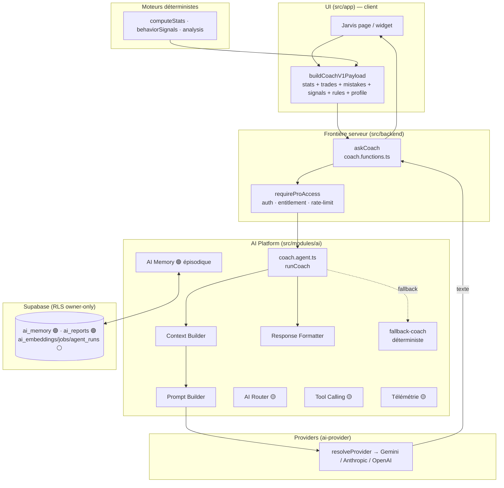
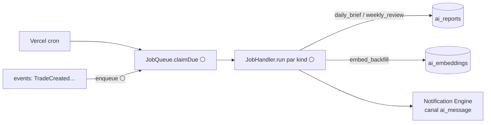

# TradeVault — Architecture IA

> **Document propriétaire de la plateforme IA** : principe, sous-systèmes,
> providers, contexte, prompts, outils, agents (présents et futurs), coûts,
> sécurité IA. Le *comment c'est construit*.
>
> Le rôle produit, l'identité, la persona et la voix de l'IA sont dans
> [`JARVIS.md`](JARVIS.md). La stratégie temporelle (V1 → V2) est dans
> [`ROADMAP.md`](ROADMAP.md).
>
> **Légende d'état** : 🟢 Livré (exécuté en prod) · 🟡 Fondation (contrats
> compilés et testés, zéro logique runtime) · ⚪ Planifié (types seuls ou
> migration non appliquée).
>
> Dernière vérification contre le code : **2026-07-28**.

---

## 1. Principe directeur

> **Une plateforme = des briques remplaçables derrière des contrats, reliées par
> un idiome unique : le registre de plug-ins.**

Un chatbot, c'est `question → LLM → réponse`. Une plateforme, c'est un pipeline
gouverné : intention → contexte → agent → outils → mémoire → télémétrie, où
chaque étage est **isolé, testable, remplaçable**, et où **ajouter une capacité =
enregistrer un plug-in**, jamais réécrire l'existant.

La couche provider le fait déjà (`resolveProvider()` : ajouter un modèle = un
fichier + une ligne). L'AI Platform applique le même patron aux agents, outils,
jobs et à la RAG.

**Trois invariants (hérités de `CLAUDE.md`)**

- **Provider-agnostique** — l'app ne sait jamais quel modèle répond (chat *et*,
  à terme, embeddings, derrière une interface). Changer de modèle = une variable
  d'environnement.
- **Déterministe avant IA** — les moteurs purs (Trade Analysis, Discipline, plus
  les utilitaires `computeStats` / `computeQuantStats` /
  `computeBehaviorSignals`) calculent les chiffres ; l'IA les **interprète**,
  ne les recalcule jamais.
- **Ce qui survit au runtime va en DB (RLS owner-only)** — mémoire, rapports,
  embeddings, jobs, télémétrie.

**Sens des dépendances (invariant)** : `app → backend → modules/ai →
ai-provider`. La couche `ai` ne connaît ni React ni le vendeur. Sur le bus
d'événements, les payloads IA sont **primitifs** : la dépendance pointe toujours
`ai → core`, jamais l'inverse.

---

## 2. Ce qui tourne réellement en production

**À lire en premier — la vérité du runtime, avant la vision.**

Une seule chaîne IA est effectivement exécutée par une surface UI aujourd'hui :

```
UI (Jarvis page / widget AiAssistant)
  → buildCoachV1Payload()          (app/utils/aiContext.ts — synchrone, zéro DB)
  → askCoach()                     (backend/coach.functions.ts — Zod + requireProAccess)
  → runCoach()                     (modules/ai/agents/coach.agent.ts)
      → createContextBuilder()     (contexte ancré, capé)
      → buildPrompt()              (identité Jarvis + ANTI_HALLUCINATION + format)
      → generate()                 (provider-service : resolveProvider + retry + onUsage)
      → toFormatted()              (response-formatter)
  → sinon fallbackCoachAnswer()    (coach déterministe, zéro coût, même grounding)
```

Tout le reste (Router, Agent System, Tool Calling, MCP, RAG, Jobs, télémétrie,
et le catalogue de services `ai.functions.ts`) est **compilé, typé et pour
partie testé, mais n'est appelé par aucune surface UI**. C'est une fondation
délibérée, pas du code mort accidentel — mais la documentation ne doit pas
laisser croire qu'elle tourne. Voir §10 (état réel) et [`ROADMAP.md` §6](ROADMAP.md).

---

## 3. Vue d'ensemble



---

## 4. Les huit sous-systèmes

### 4.1 Providers — 🟢 Livré

`src/modules/ai-provider/` — l'app ne parle jamais à un SDK vendeur.

- **Contrat** : `AIProvider.complete(AIRequest) → AIResponse`.
  `AIRequest { messages, maxTokens?, temperature?, json?, tools?, toolChoice? }` ·
  `AIResponse { text, provider, model, usage?, toolCalls?, finishReason? }`
  (`provider` / `usage` = télémétrie, **jamais de branchement applicatif**).
- **Résolution** : `resolveProvider()` → `AI_PROVIDER` si configuré et valide,
  sinon le **premier provider configuré** dans l'ordre
  `[Gemini, Anthropic, OpenAI]`. Lève une erreur explicite si aucun n'est
  configuré. `resolveToolCapableProvider()` filtre sur `supportsTools`.
- **En place** : `gemini.ts` (défaut, `gemini-2.5-flash`, texte seul),
  `anthropic.ts` (tool-calling), `openai.ts` (tool-calling, compatible tout
  endpoint OpenAI via `OPENAI_BASE_URL`). **Ajouter Mistral / DeepSeek /
  Ollama** = un fichier + une ligne dans `registry.ts`.

| Provider | `complete()` | Tool calling | Activation |
| --- | --- | --- | --- |
| Gemini | ✅ | — (texte) | `GEMINI_API_KEY` |
| Anthropic | ✅ | ✅ | `ANTHROPIC_API_KEY` (+ `ANTHROPIC_MODEL`) |
| OpenAI-compatible | ✅ | ✅ | `OPENAI_API_KEY` (+ `OPENAI_BASE_URL`, `OPENAI_MODEL`) |

### 4.2 Context Builder — 🟢 Livré

`src/modules/ai/context.ts` + `context-builder.ts` — assemble **côté client** ce
que l'IA peut savoir du trader (là où la donnée vit déjà, en cache React Query)
et le sérialise en **blocs ancrés citables**.

- **`AIUserContext`** (tous champs optionnels → dégradation gracieuse) :
  `trades`, `stats` (précalculées), `goals`, `mistakes`, `signals`
  (signaux comportementaux déterministes), `rules`, `memory`, `conversation`,
  `language`.
- **`contextBlocks(ctx)`** → sections étiquetées : `LONG-TERM MEMORY`,
  `THE TRADER'S OWN RULES`, `ACTIVE GOALS`, `RECURRING MISTAKES`,
  `PRECOMPUTED STATS (trust these numbers)`, `BEHAVIOUR SIGNALS`,
  `RECENT TRADES (JSON)`.
- **Caps stricts** (`CONTEXT_CAPS`, miroirs des limites Zod serveur) :
  trades ≤ 500, goals ≤ 10, mistakes ≤ 40, rules ≤ 30, memory ≤ 60
  (≤ 2000 c/entrée), conversation ≤ 20 tours (≤ 8000 c/tour).
- **Grounding** : on injecte des **stats déterministes** → le modèle cite, il ne
  calcule pas (anti-hallucination + économie de tokens).

### 4.3 Prompt Builder — 🟢 Livré

`prompt-builder.ts` — `buildPrompt(PromptSpec)` transforme *identité + tâche +
contexte + conversation + tour courant + format* en `AIMessage[]`. **Aucune
persona câblée** : l'identité et la tâche sont des entrées (les agents
fournissent leur voix). En multi-tours, le contexte est posé comme échange
initial puis les tours réels suivent ; sinon il est préfixé à l'unique tour.

### 4.4 AI Router — 🟡 Fondation

`router/` — décide **quel agent**, **quel hint de modèle**, **avec ou sans RAG**.

- **Contrat** : `AIRouter.route(RoutingRequest) → RoutingDecision`.
- **Map déterministe `INTENT_AGENT`** (pure configuration) :
  `chat / analyze_trade / daily_brief → coach` ·
  `weekly_review / performance_review → performance-analyst` ·
  `detect_patterns → pattern-finder` · `psychology_check → psychologist` ·
  `assess_risk → risk-manager`.
- Classifieur free-text **injectable** (seam), fallback `chat`. Intentions
  `chat` et `psychology_check` marquées `useRetrieval`.
- **`defaultRouter` est exporté et testé, mais aucune surface UI ne le
  branche** : le coach V1 court-circuite le router (intention `chat` implicite).

### 4.5 Agent System — 🟡 Fondation · coach 🟢 via service

`agents/` — un plug-in par système IA.

- `catalog.ts` décrit **5 agents déclarativement** (blueprints : persona,
  outils autorisés, format de sortie). C'est de la **métadonnée**, pas du code.
- `registry.ts` gère `registerAgent / getAgent / listReadyAgents` — **vide au
  runtime** (aucun `AgentDefinition.run()` enregistré).
- `coach.agent.ts` **n'est pas** un `AgentDefinition` enregistré dans ce
  registre : c'est une fonction `runCoach()` appelée directement par
  `askCoach`. L'agent coach est donc « vivant » via le service, pas via le
  système d'agents formalisé.

| Agent (blueprint) | Rôle | Outils autorisés | État |
| --- | --- | --- | --- |
| `coach` | Mentor conversationnel | `get_stats`, `get_trades`, `search_memory`, `get_rules`, `get_goals` | 🟢 servi via `runCoach` (sans outils) |
| `performance-analyst` | Lecture quant, JSON | `get_stats`, `get_trades`, `compute_quant_stats` | ⚪ blueprint |
| `psychologist` | Biais & tilt | `get_trades`, `search_memory`, `get_discipline_events` | ⚪ blueprint |
| `risk-manager` | Exposition & règles, JSON | `get_stats`, `get_rules`, `get_discipline_events`, `assess_trade_risk` | ⚪ blueprint |
| `pattern-finder` | Schémas récurrents, JSON | `get_trades`, `get_stats`, `search_memory` | ⚪ blueprint |

### 4.6 Tool Calling — 🟡 Fondation

`tools/types.ts` (registre + contrats) + `tools/runtime.ts` (exécution).

- Un `ToolDefinition` a un `name`, un `inputSchema` (JSON-Schema), un flag
  `sideEffect` et une `source` (`local` / `mcp`). Le **runtime** exécute — jamais
  l'agent, jamais le SDK vendeur : chaque appel est **auditable et
  permissionné**.
- `executeToolCalls` **ne throw jamais** (un outil inconnu ou en échec devient un
  `ToolResult.error`), et **refuse les outils à effet de bord** sauf
  `allowSideEffects` explicite (défaut : read-only).
- `runWithTools` (provider-service) boucle : appel → si outils demandés,
  exécuter et réinjecter → répéter jusqu'à réponse ou `maxIterations` (défaut 4),
  puis force une réponse finale sans outils.
- **MCP** (`mcp/types.ts`) passe par **le même contrat** : un
  `McpClientAdapter.listTools` produit des `ToolDefinition(source:"mcp")`
  enregistrés normalement. MCP est un détail d'intégration, pas une bifurcation.
- **Aucun outil métier n'est enregistré aujourd'hui.** Le registre est vide au
  runtime ; le coach V1 tourne **sans** outils (contexte pré-assemblé suffisant).
  La boucle `runWithTools` est couverte par les tests avec des outils factices.

### 4.7 AI Memory — 🟢 épisodique · ⚪ sémantique (RAG)

`memory.ts` (table `ai_memory`, RLS owner-only).

- **Épisodique 🟢** : kinds `profile` / `fact` / `lesson` / `conversation` ;
  API `loadMemory` / `remember` / `forget`.
- **Semé à l'onboarding** : `seedProfileMemory()` écrit une entrée `profile`
  déterministe (coût IA nul, idempotent).
- **⚠️ État réel** : `ai_memory` **n'est pas injectée dans le coach V1**.
  `buildCoachV1Payload` est synchrone et ne lit pas la DB ; le profil arrive
  plutôt via `describeProfile()` (onboarding en mémoire locale). Une fonction
  `buildCoachContext()` qui *lit* `ai_memory` existe mais n'est appelée par
  aucune surface. Brancher la mémoire longue durée = **V2** ([`ROADMAP.md`](ROADMAP.md)).
- **Sémantique (RAG) ⚪** : `rag/types.ts` (`EmbeddingProvider` + `Retriever`) +
  table `ai_embeddings` (pgvector `vector(1536)`, migration non appliquée).

### 4.8 Services & Télémétrie — 🟢 / 🟡

- **Service en prod** : `backend/coach.functions.ts` (`askCoach`). Recette :
  contexte validé (Zod + caps) → agent coach → provider → fallback déterministe.
- **Catalogue historique 🟡** : `backend/ai.functions.ts` (`aiChat`,
  `aiGenerateDailyBrief`, `aiGenerateWeeklyReview`, `aiAnalyzeTrade`,
  `aiDetectPatterns`, `aiGenerateLessons`) — compilé, gaté, **mais appelé par
  aucune surface UI** et porteur d'une **identité de prompt concurrente**
  (`COACH_IDENTITY` local). Dette à trancher (§10, [`ROADMAP.md` §6](ROADMAP.md)).
- **Télémétrie 🟡** : `telemetry.ts` définit `AgentRun` + `TelemetryRecorder` ;
  le seam `onUsage` de `generate()` est câblé, mais **aucun writer vers
  `ai_agent_runs`** n'est implémenté.

---

## 5. Flux asynchrone (planifié)



Les Background Jobs (`jobs/types.ts` : `JobHandler` + `JobQueue`, table
`ai_jobs`) sont **planifiés** : c'est la fondation des Daily Brief / Weekly
Review automatiques et du backfill d'embeddings, sans bloquer une requête.

---

## 6. Dossiers

```
src/modules/ai/                ← LA PLATEFORME
  index.ts        🔴 façade AI.* (ré-exporte ai.functions — importée par personne)
  infra.ts        🟢 barrel d'infrastructure (generate, runWithTools, buildPrompt…)
  context.ts      🟢 contrat AIUserContext + contextBlocks
  context-builder.ts 🟢 builder capé
  prompt-builder.ts  🟢 buildPrompt (aucune persona câblée)
  provider-service.ts 🟢 generate + runWithTools + hook onUsage
  response-formatter.ts 🟢 normalisation + parsing JSON sûr + registre de formats
  fallback-coach.ts  🟢 coach déterministe (secours)
  memory.ts       🟢 mémoire épisodique (ai_memory)
  telemetry.ts    🟡 AgentRun + recorder (aucun writer)
  agents/         🟡 types · catalog (5 blueprints) · registry (vide) · coach.agent 🟢
  router/         🟡 types (INTENT_AGENT) · router (defaultRouter, non branché)
  tools/          🟡 types (registre vide) · runtime (executeToolCalls)
  rag/  types.ts  ⚪ EmbeddingProvider + Retriever
  jobs/ types.ts  ⚪ JobHandler + JobQueue
  mcp/  types.ts  🟡 client/server adapters

src/modules/ai-provider/       ← Providers (server-only)
  types.ts · registry.ts · gemini.ts · anthropic.ts · openai.ts · index.ts

src/backend/
  coach.functions.ts 🟢 askCoach — LE service en prod
  ai.functions.ts    🟡 catalogue historique (non branché)
  require-pro.ts     🟢 middleware entitlement + rate-limit
```

**Import** : l'infrastructure se consomme via
`import { … } from "@/modules/ai/infra"`.

---

## 7. Futurs agents IA — architecture d'extension

C'est la promesse structurelle de la plateforme : **ajouter un système IA ne
modifie jamais un agent, un service ou un moteur existant.**

**Recette d'ajout d'un agent** (rien d'existant n'est touché) :

1. `agents/<x>.agent.ts` — implémente `AgentDefinition.run()` sur le blueprint
   du `catalog.ts` (persona, outils, format déjà déclarés).
2. `registerAgent(<x>)` — l'enregistre dans le registry.
3. Entrée `INTENT_AGENT` — l'intention route vers lui (déjà mappée pour les 5).
4. Si besoin : un outil (`registerTool`), un job (`registerJobHandler`), une
   entrée de retrieval — chacun par le même patron de registre.
5. Une server function dédiée (auth + gating + rate-limit) + la spec dans la
   documentation.

**Ordre de bataille recommandé (par valeur)** : Tool Calling read-only sur le
coach existant → RAG (embeddings trades/notes) → Jobs (Daily Brief / Weekly
Review) → Performance Analyst → Risk Manager → Pattern Finder → Psychologist →
MCP. Détail temporel : [`ROADMAP.md`](ROADMAP.md).

---

## 8. Coûts

**Contrôles en place 🟢**

| Levier | Mécanisme |
| --- | --- |
| Rate-limit / utilisateur | `consume_ai_quota` (fenêtre fixe atomique SQL), défaut 60/h (`AI_RATE_LIMIT_PER_HOUR`), **fail-open** sur erreur infra |
| Budgets de tokens | `maxTokens` par appel (coach 2048) |
| Grounding compact | Stats précalculées et scalaires plutôt que trades bruts |
| Caps d'entrée Zod | trades ≤ 500, mistakes ≤ 40, conversation ≤ 20, signaux ≤ 12 Ko |
| Provider bon marché par défaut | Gemini en primaire ; premium réservé à la haute valeur |
| Retry unique | Une seule reprise, sur erreur transitoire uniquement (`isTransient`) |
| Fallback déterministe | Aucun coût quand le provider est absent ou en échec |

**À construire ⚪** : télémétrie attribuable (`ai_agent_runs`), arbitrage de
modèle par le router (rapide/pas cher vs premium), jobs asynchrones pour l'IA
lourde, compaction mémoire / RAG, quotas différenciés Free/Pro.

---

## 9. Sécurité IA

| Garde-fou | État | Détail |
| --- | --- | --- |
| Secrets serveur-only | 🟢 | Clés via `process.env` dans `backend/` ; rien côté client |
| Auth obligatoire | 🟢 | `requireSupabaseAuth` avant tout endpoint IA |
| Entitlement | 🟢 | `requireProAccess` derrière `AI_REQUIRE_PRO` (OFF en beta) ; fail-open infra, fail-closed au payant |
| Rate-limit anti-abus | 🟢 | `consume_ai_quota`, indépendant du paywall |
| Validation d'entrée | 🟢 | Zod strict + caps de taille |
| RLS owner-only | 🟢 | Toutes les tables `ai_*` isolées par utilisateur |
| Anti-hallucination | 🟢 | Grounding chiffres réels + règle `ANTI_HALLUCINATION` + fallback déterministe qui déclare l'absence de donnée |
| Outils permissionnés & audités | 🟡 | `sideEffect` refusé par défaut ; télémétrie à brancher |
| Données MCP externes | ⚪ | À traiter comme input non fiable (validation stricte des sorties d'outils) |

---

## 10. État réel et ordre de construction

- **Fait 🟢** : Providers, Context Builder, Prompt Builder, Response Formatter,
  Provider Service (generate + runWithTools), AI Memory épisodique, **agent
  coach servi via `askCoach`**, fallback déterministe, rate-limit / entitlement.
- **Fondation 🟡** : Router, Agent System (blueprints + registry vide), Tool
  Calling (registre vide), MCP, télémétrie, catalogue `ai.functions.ts` — tout
  compile et pour partie est testé, **rien n'est branché sur une surface UI**.
- **Planifié ⚪** : RAG, Jobs, migration `ai_os_foundation`, agents spécialisés,
  injection de la mémoire longue durée dans le coach.

**Écarts à trancher (dette IA, → [`ROADMAP.md` §6](ROADMAP.md)) :**

1. **Deux systèmes de prompt pour une identité** : `coach.agent.ts`
   (`coachIdentity`, en prod) et `ai.functions.ts` (`COACH_IDENTITY`, non
   branché). Décider : retirer/aligner `ai.functions.ts`.
2. **Façade `modules/ai/index.ts`** importée par personne.
3. **Mémoire semée mais non lue** par le coach V1.

_La fondation IA est une conception délibérée. « Ajouter un système IA » ne
modifie jamais un agent, un service ou un moteur existant : c'est la garantie
structurelle d'une plateforme — et le fil conducteur de la roadmap IA._
