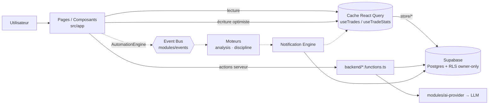

# TradeVault — Architecture

> **Document propriétaire de la structure du code** : dossiers, couches, sens
> des dépendances, architecture frontend, moteurs métier, flux de données,
> automatisations, et **standards de développement**.
>
> Frontière serveur : [`BACKEND.md`](BACKEND.md) · Données :
> [`DATABASE.md`](DATABASE.md) · IA : [`AI_ARCHITECTURE.md`](AI_ARCHITECTURE.md) ·
> UI/UX : [`UX_RULES.md`](UX_RULES.md) et [`DESIGN_SYSTEM.md`](DESIGN_SYSTEM.md).
>
> Objectif : rendre un développeur (humain ou agent IA) opérationnel en **moins
> de 30 minutes**. Dernière vérification contre le code : **2026-07-28**.

---

## 1. En une minute

- **Front** : SPA React 19 servie par **TanStack Start** (shell SSR +
  hydratation). Une seule route applicative (`/`) ; la navigation interne est un
  état React, pas une URL.
- **Back** : **server functions** TanStack (`createServerFn`) + quelques
  endpoints HTTP bruts dans `src/server.ts`. Pas d'API REST séparée.
- **Données** : **Supabase** (Postgres + Auth + Storage + Realtime), sécurisé
  par **RLS owner-only**.
- **Runtime** : **Bun**, build **Vite**, déploiement **Vercel** via Nitro.

**Règle d'or** : la couche UI (`src/app/`) importe les moteurs
(`src/modules/`) — **jamais l'inverse**. Aucune logique métier dans un composant.

---

## 2. Structure des dossiers

```
src/
├── routes/              ← Routing fichier TanStack (le SEUL routeur d'URL)
│   ├── __root.tsx       ← shell : head/SEO, viewport, PWA, QueryClientProvider,
│   │                      error boundary 404/500, <Outlet/>
│   ├── index.tsx        ← "/" → monte <App/> (toute l'app authentifiée)
│   ├── privacy.tsx · terms.tsx · reset-password.tsx
│   └── README.md        ← conventions de routing TanStack
│
├── app/                 ← COUCHE PRÉSENTATION (React)
│   ├── App.tsx          ← orchestrateur : auth, navigation interne, écritures
│   │                      optimistes, bootstrap des moteurs
│   ├── types.ts         ← types métier client (Trade, TradeStats, Page, …)
│   ├── navigation.ts    ← SOURCE UNIQUE de la navigation (6 groupes)
│   ├── store.ts         ← barrel de persistance (ré-exporte store/*)
│   ├── store/           ← accès Supabase par domaine (trades, accounts,
│   │                      profile, missed, reports, storage, ids)
│   ├── pages/           ← une vue par page (+ sous-dossiers co-localisés :
│   │                      landing/, checklist/, dashboard/, goals/)
│   ├── components/      ← composants transverses (modals, nav, charts, Jarvis…)
│   ├── hooks/           ← hooks data/UI (useTrades, useTradeStats, …)
│   ├── contexts/        ← providers transverses (Auth, Account, Theme, Toast,
│   │                      Confirm)
│   ├── utils/           ← calculs purs & helpers (stats, signaux, edge, CSV…)
│   ├── i18n/            ← LanguageContext + 12 locales (en = clés source)
│   └── onboarding/      ← premier lancement (wizard 6 étapes + copy)
│
├── modules/             ← MOTEURS métier (aucun React, aucun IO direct)
│   ├── events/          ← Event Bus typé — le système nerveux
│   ├── trading/analysis ← Trade Analysis Engine (pur, déterministe)
│   ├── discipline/      ← Discipline Engine (règles → événements)
│   ├── automation/      ← Automation Engine (pipeline de steps)
│   ├── notifications/   ← Notification Engine (toast · push · dashboard)
│   ├── voice/           ← Voix de Jarvis (profil, prosodie, sélection locale)
│   ├── ai/              ← AI Platform (contexte, prompts, outils, agents…)
│   └── ai-provider/     ← Abstraction multi-fournisseurs IA
│
├── backend/             ← FRONTIÈRE SERVEUR (server-only ; secrets ici)
│   ├── *.functions.ts   ← server functions appelables depuis l'UI
│   ├── *.server.ts      ← helpers serveur internes (billing, e-mails, crons)
│   ├── require-pro.ts   ← middleware auth + entitlement + rate-limit
│   └── README.md
│
├── integrations/supabase← client typé, attache d'auth, middleware d'auth
├── shared/              ← helpers neutres + shared/ui (Design System)
├── server.ts            ← entrée serveur : endpoints HTTP bruts + crons
└── styles.css           ← tokens --tv-*, glass, animations (1 670 lignes)
```

**Racine** : `supabase/migrations/` · `supabase/functions/delete-account/` ·
`public/` (PWA, service worker push) · `scripts/preview.mjs` · `tests/` ·
`vercel.json` · `.env.example`.

---

## 3. Couches et sens des dépendances

```
routes/  →  app/  →  modules/                    (l'UI consomme les moteurs)
   │         │
   │         └────→  backend/*.functions.ts      (l'UI appelle le serveur)
   │
backend/ →  modules/  +  integrations/supabase   (le serveur exécute les moteurs)

modules/ ne dépend JAMAIS de app/ (UI) ni de React.   ⚠️ invariant
shared/  ne dépend JAMAIS de app/ ni de modules/.     ⚠️ invariant
```

| Dossier | Responsabilité | Peut importer | Ne doit **pas** importer |
| --- | --- | --- | --- |
| `src/routes/` | Routing fichier, shell HTML, SEO/meta, error boundaries | `app/`, `shared/` | logique métier |
| `src/app/` | Tout le rendu et l'état client | `modules/`, `backend/*.functions.ts`, `integrations/`, `shared/` | — |
| `src/modules/` | Moteurs purs, réutilisables, testables | autres `modules/`, types du noyau | `app/` (UI), React, secrets |
| `src/backend/` | Exécution serveur, secrets, crons, e-mails, paiement | `modules/`, `integrations/`, `process.env` | code client |
| `src/integrations/supabase/` | Client typé, attache d'auth, middleware | `shared/` | `app/` |
| `src/shared/` | Helpers neutres + primitives UI feuilles | rien de métier | `app/`, `modules/` |
| `src/assets/` | Ressources statiques importées par le bundle (logo, images) | — | tout code |

**Fichiers racine de `src/`** : `router.tsx` (fabrique du routeur TanStack +
défauts React Query), `start.ts` (entrée serveur TanStack Start), `server.ts`
(routes serveur robots/sitemap), `styles.css` (tokens + Tailwind),
`routeTree.gen.ts` (généré, commité pour des builds reproductibles).

**Exception encadrée** : `src/shared/ui/` utilise React (ce sont des primitives
feuilles) mais n'importe jamais `app/`.

> **Dette assumée, documentée** : plusieurs moteurs importent encore
> `@/app/types` (`Trade`) et deux utilitaires côté app (`generateId` depuis
> `app/store`, `checkTradeAgainstRules` depuis `app/utils/tradingRules`). Le
> sens `modules → app` est donc violé de manière limitée et connue.
> Correctif cible : extraire un noyau `src/domain/` — voir
> [`ROADMAP.md` §6](ROADMAP.md). Non bloquant, jamais en urgence.

---

## 4. Architecture frontend

### 4.1 Routing — deux niveaux distincts

**Niveau 1 — routes d'URL (TanStack Start, routing fichier).**

| Fichier | URL | Rôle |
| --- | --- | --- |
| `__root.tsx` | (toutes) | Shell : head/SEO/PWA, viewport verrouillé, `QueryClientProvider`, boundaries 404/500 |
| `index.tsx` | `/` | Monte `<App/>` — toute l'application authentifiée |
| `reset-password.tsx` | `/reset-password` | Réinitialisation de mot de passe |
| `privacy.tsx` · `terms.tsx` | `/privacy` · `/terms` | Pages légales |
| `contact.tsx` | `/contact` | Page de contact publique (support, facturation, RGPD, sécurité) |

**Routes publiques et SEO.** Les quatre routes publiques (`/`, `/privacy`,
`/terms`, `/contact`) déclarent leurs métadonnées via `pageSeo()`
(`src/shared/seo.ts`) : titre, description, `robots`, Open Graph et Twitter
Card complets, et **URL canonique absolue**. Toutes les URL absolues dérivent de
`SITE_URL` — brancher un domaine personnalisé ne demande aucune édition. Les
trois pages publiques rendent **hors de l'arbre applicatif** (pas de
`LanguageProvider`) et lisent la langue persistée via `usePersistedLang()`.

`robots.txt` et `sitemap.xml` sont **générés** par `src/server.ts` depuis
`SITE_URL`. Un déploiement de preview répond sur un autre hôte et reçoit
délibérément `Disallow: /`, pour ne jamais concurrencer la production dans
l'index.

`routeTree.gen.ts` est **auto-généré** — ne jamais l'éditer. Ne jamais créer
`src/pages/` ni de layouts façon Next/Remix : le seul layout racine est
`__root.tsx`.

**Niveau 2 — navigation applicative (état React).** Après `/`, la navigation
entre Dashboard / Journal / Analytics / … se fait via l'état `page: Page` dans
`App.tsx`. Chaque page est un `lazy()` chargé à la demande avec ses dépendances
lourdes (recharts, react-markdown). Seul `Dashboard` reste dans le chunk
principal (c'est l'écran d'atterrissage).

**Deep-links supportés** par query params sur `/` :
`?report=YYYY-MM` (ouvre les Rapports) · `?upgrade=1` (ouvre le Profil).

**Conséquence assumée** : pas d'URL par page interne (donc ni partage de lien
profond, ni bouton retour navigateur par page). C'est le prix de la simplicité
actuelle ; la migration éventuelle vers des routes d'URL est un chantier de
fond, pas une urgence.

### 4.2 Navigation — source unique

`src/app/navigation.ts` est **la** source de vérité : `NAV_GROUPS` (6 groupes
suivant le déroulé d'une session), `MOBILE_BAR` (3 pages promues en barre
basse), `NAV_ITEMS` (liste plate pour la palette ⌘K), `MOBILE_MORE_GROUPS`.
`Sidebar`, `MobileNav` et `CommandPalette` en **dérivent** : ajouter, retirer ou
réordonner une page est une modification d'un seul fichier, et les trois
surfaces ne peuvent pas diverger. Détail des groupes et des pages :
[`UX_RULES.md` §2–3](UX_RULES.md).

### 4.3 État et données côté client

| Mécanisme | Usage |
| --- | --- |
| **React Query** | Source des trades — clé `["trades", userId, accountId]`. Changer de sous-compte = refetch keyé ; revenir = instantané. |
| **`useTradeStats`** | Dérive **toutes** les statistiques du tableau de trades **en mémoire**, via des fonctions pures. Zéro requête, zéro N+1. |
| **Contextes React** | `AuthContext`, `AccountContext` (sous-comptes), `LanguageContext`, `ThemeContext`, `ToastContext`, `ConfirmContext`. |
| **Supabase Realtime** | `useRealtimeProfile` — synchronisation du profil entre onglets/appareils. |
| **`localStorage` namespacé** | Conversations Jarvis, brouillons de trade, checklist du jour, dédup des push — via `nsKey(userId, …)` (`utils/persistence.ts`) : jamais de fuite d'un utilisateur à l'autre sur un appareil partagé. |

### 4.4 Pages et composants

19 pages dans `app/pages/` (dont `Landing`, publique). Les sous-composants
propres à une page lourde sont **co-localisés** (`pages/landing/`,
`pages/checklist/`, `pages/dashboard/`, `pages/goals/`) ; seuls les composants
réellement transverses vivent dans `app/components/`.

| Composant transverse | Rôle |
| --- | --- |
| `Sidebar` · `MobileNav` | Navigation desktop / mobile (dérivées de `navigation.ts`) |
| `TradeModal` · `TradeDetailModal` | Création/édition et détail d'un trade |
| `AiAssistant` · `MarkdownAnswer` | Widget Jarvis flottant + rendu Markdown des réponses |
| `CommandPalette` | Palette ⌘K (cmdk) |
| `ImportCsvModal` | Import de trades depuis un CSV courtier |
| `AccountSwitcher` | Bascule entre sous-comptes (FAB mobile) |
| `EquityChart` | Courbe d'équité (lazy — allège nettement le bundle initial) |
| `PushNotificationSettings` · `PushOnboardingBanner` | Web-push |
| `ThemeSettings` · `CursorGlow` · `Lightbox` · `Skeleton` | Thème, ambiance, chargement |
| `TradingRulesSection` · `SubscriptionSection` | Sections réutilisées (Réglages / Profil) |
| `MissedSetupDetailModal` · `ErrorScreen` · `PageErrorBoundary` | Détail setup manqué, écrans 404/500, isolation d'erreur par page |
| `TrustpilotPrompt` · `TrustpilotWidget` | Avis — ⚠️ **zone gelée** |

### 4.5 Hooks

| Hook | Rôle |
| --- | --- |
| `useTrades` | Source des trades (React Query, migration des screenshots legacy) |
| `useTradeStats` | Statistiques dérivées, mémoïsées |
| `useTradingRules` | Règles personnelles du trader |
| `useRealtimeProfile` | Synchronisation du profil (Realtime) |
| `useScreenshotUrls` | URLs signées depuis Supabase Storage |
| `useSubscription` | État d'abonnement (statut seul en beta) |
| `usePushNotifications` | Permission, souscription, envoi de test |

### 4.6 Types métier

`src/app/types.ts` est la source unique côté client :

- **`Trade`** — entité centrale : `pnl`, `rMultiple`, `riskAmount`,
  `setupQuality` (1–5), `confluences`, `mistakes`, `screenshots`, `confidence`,
  champs quant optionnels `mae` / `mfe` / `slippage`, et `isExample` (trade de
  démo, badgé jusqu'à édition).
- **`TradeDirection`** = `"long" | "short" | "be"` (+ helper `isBreakEven`).
- **`TradeStats`** — objet dérivé complet (`winRate`, `profitFactor`,
  `maxDrawdown`, streaks, `equityCurve`, `pnlByStrategy`, `pnlByDayOfWeek`,
  `mistakeStats`, …).
- **`Page`** — union des 18 vues internes ; pilote la navigation.
- Catalogues partagés : `STRATEGIES` (dont setups ICT), `MISTAKE_OPTIONS`,
  `DEFAULT_CONFLUENCES`, `LANGUAGES` (12), `SUPPORT_EMAIL`.

Les moteurs ont **leurs propres** types (`modules/*/types.ts`), exposés par leur
`index.ts`. Les types de la base sont **générés** dans
`integrations/supabase/types.ts` — ne jamais les éditer à la main.

### 4.7 Internationalisation

- **12 langues** : `en` (jeu de clés source), `es`, `pt`, `fr`, `de`, `it`,
  `nl`, `ru`, `zh`, `ja`, `ar`, `hi`.
- L'anglais est embarqué dans le bundle principal ; les 11 autres dictionnaires
  sont **code-split** et chargés à la demande, avec repli sur l'anglais pendant
  le chargement.
- **Aucune détection automatique de la locale navigateur** : le défaut est
  l'anglais, la langue ne change que sur choix explicite (persisté en
  `localStorage` + profil Supabase).
- La langue de l'UI **pilote la langue des réponses écrites de Jarvis**.
- ⚠️ **Écart connu** : `Landing.tsx` est **entièrement en français codé en
  dur** (zéro `useT()`). Voir [`ROADMAP.md` §6](ROADMAP.md).

---

## 5. Moteurs métier (`src/modules/`)

Quatre moteurs déterministes, purs, sans React ni IO, reliés par un bus
d'événements. **Ajouter une fonctionnalité = ajouter un événement + un listener
ou un step** — on n'édite jamais un moteur pour en brancher un autre.

### 5.1 Event Bus (`modules/events`)

Bus in-process **fortement typé** (`DomainEvents`) et **par runtime** (onglet
navigateur ou invocation serveur). Les handlers sont **isolés en erreur** : un
listener qui échoue ne casse ni l'émetteur ni les autres. Les rejets asynchrones
sont loggés, jamais attendus.

Vocabulaire d'événements (= la logique métier en un coup d'œil) :
`TradeCreated` · `TradeUpdated` · `TradeDeleted` · `TradeAnalyzed` ·
`DISCIPLINE_WARNING` · `DISCIPLINE_LIMIT_REACHED` · `DISCIPLINE_SUCCESS` ·
`GoalUpdated` · `GoalCompleted` · `DailyBriefReady` · `WeeklyReviewReady` ·
`NewPatternDetected` · `NotificationCreated` · `DailyReset` · et les événements
de l'AI OS (`AgentRunStarted/Completed`, `AiJobEnqueued/Completed`,
`DocumentIndexed`, `AiNotificationRequested`) dont les payloads sont
**primitifs**, pour que le noyau ne dépende jamais de `modules/ai`.

> La livraison cross-runtime (serveur → autre appareil) ne passe **pas** par ce
> bus mais par les notifications persistées.

### 5.2 Trade Analysis Engine (`modules/trading/analysis`)

`analyzeTrade(trade, ctx) → TradeAnalysis`. **Pur, déterministe, sans
dépendance** : même entrée, même sortie — exécutable en test, sur le serveur ou
dans le navigateur.

Produit quatre sous-scores 0–100 (`rrScore`, `setupScore`, `disciplineScore`,
`executionScore`), un score composite pondéré (30/25/30/15), une note `A`→`F`,
le `riskPct`, l'`exitEfficiency` (P&L réalisé / MFE) et une liste de **flags**
stables (`oversized_risk`, `no_stop_defined`, `negative_expectancy_rr`,
`low_setup_quality`, `missing_confluences`, `poor_exit_efficiency`,
`high_slippage`, `tagged_mistakes`, `revenge_window`, `overtrading_day`,
`clean_execution`).

Choix de conception cohérent avec la philosophie produit : **une perte contenue
à 1R obtient un bon score R:R** — le stop a fait son travail.

### 5.3 Discipline Engine (`modules/discipline`)

Seul endroit où une décision de discipline est prise. Les pages n'évaluent
jamais une règle : elles passent le trade au moteur (via l'Automation Engine) et
réagissent aux événements `DISCIPLINE_*`. L'évaluation elle-même est déléguée au
vérificateur pur `checkTradeAgainstRules` (source unique des messages
localisés). Les règles `stop_after_losses` et `max_risk_pct` sont des **limites
dures** → `DISCIPLINE_LIMIT_REACHED` ; les autres → `DISCIPLINE_WARNING`. Une
journée sans écart émet `DISCIPLINE_SUCCESS`.

### 5.4 Automation Engine (`modules/automation`)

La chaîne de montage « trade sauvegardé ». Pipeline de **steps ordonnés**
(`order` 10/20/30…, avec des trous pour l'extension), **isolés en erreur** ; un
step de validation peut arrêter la ligne en retournant `false`.

Pipeline par défaut :

| Ordre | Step | Effet |
| --- | --- | --- |
| 10 | `validate` | Garde d'intégrité minimale (id, date, userId) — un trade malformé n'atteint jamais les moteurs |
| 20 | `analyze` | `analyzeTrade` + émission de `TradeAnalyzed` |
| 30 | `discipline` | `DisciplineEngine.checkTrade` — **uniquement sur un nouveau trade** (une édition ne re-déclenche pas le coaching) |

Ajouter une automatisation = `registerStep({ name, order, run })`. Aucune page
ne chaîne d'effets de bord à la main.

### 5.5 Notification Engine (`modules/notifications`)

Entonnoir unique de tout ce qui est dit à l'utilisateur. Canaux :
`dashboard` (persisté) · `toast` · `push` · `email` · `ai_message`.

- Les **adaptateurs sont injectés au bootstrap** (`NotificationEngine.configure`
  dans `App.tsx`) : le moteur n'importe ni React, ni contexte, ni server
  function.
- Le **câblage domaine → notification** est fait **en un seul endroit** (les
  listeners `DISCIPLINE_*` du moteur) — plus aucun `toast()` dispersé dans les
  pages pour un événement métier.
- **Anti-spam push** : `dedupKey` limite à **un push par clé et par jour**
  (le toast et l'enregistrement dashboard, eux, se déclenchent toujours).
- Chaque notification émet `NotificationCreated` pour que n'importe quelle
  surface (badge, inbox) puisse réagir en direct.

### 5.6 Voice (`modules/voice`)

Voix de Jarvis, provider-agnostique : profil de timbre unique, découpage
prosodique déterministe, sélection de la meilleure voix masculine locale.
Détail : [`JARVIS.md` §7](JARVIS.md).

### 5.7 AI Platform (`modules/ai`, `modules/ai-provider`)

Voir [`AI_ARCHITECTURE.md`](AI_ARCHITECTURE.md).

---

## 6. Flux de données

### 6.1 Vue d'ensemble



### 6.2 Cycle de vie d'un trade (chemin critique)

1. L'utilisateur enregistre un trade dans `TradeModal`.
2. `App.tsx` fait une **écriture optimiste** : `queryClient.setQueryData` met le
   cache à jour **immédiatement**. L'UI n'attend jamais le réseau.
3. En parallèle, `store/trades.ts` (`upsertTrade`) persiste dans Supabase. **En
   cas d'échec, le snapshot précédent est restauré** et un toast d'erreur
   s'affiche — pas de faux positif silencieux.
4. `AutomationEngine.tradeSaved()` (fire-and-forget) émet `TradeCreated` /
   `TradeUpdated` puis déroule le pipeline `validate → analyze → discipline`.
5. Les moteurs communiquent **uniquement par le bus**. Aucun moteur n'appelle un
   autre moteur directement.
6. Le `NotificationEngine` route le résultat vers le bon canal ; ce qui doit
   survivre au runtime est persisté (RLS owner-only).

### 6.3 Lecture et statistiques

`computeStats(trades)` et les utilitaires dérivés (`computeQuantStats`,
`computeBehaviorSignals`, `computeBehavioral`, `computeEdgeScore`,
`computeSeasonalStats`, `buildMonthlyReport`) sont **purs et synchrones**,
exécutés **en mémoire côté client**. Aucun aller-retour serveur, aucun N+1.

> **Limite de scalabilité connue et acceptée à ce stade** : le calcul est
> linéaire dans le nombre de trades chargés. La bascule des agrégats en SQL/RPC
> avec pagination est un chantier planifié ([`ROADMAP.md`](ROADMAP.md)), à faire
> **avant** que le volume ne devienne un problème, pas après.

### 6.4 Franchissement de la frontière serveur

Coaching IA, rapports mensuels, push, paiement et e-mails passent par
`backend/*.functions.ts` ou par les endpoints HTTP de `src/server.ts`. Les
secrets (clés LLM, Stripe, Coinbase, Resend, ElevenLabs, VAPID) restent **côté
serveur**, lus via `process.env`. **Aucune clé n'atteint le client.**

---

## 7. Standards de développement

### 7.1 Conventions de nommage

| Élément | Convention | Exemple |
| --- | --- | --- |
| Composant React | `PascalCase.tsx`, un export par défaut | `TradeModal.tsx` |
| Page | `PascalCase.tsx` dans `app/pages/` | `Analytics.tsx` |
| Hook | `useXxx.ts` | `useTradeStats.ts` |
| Contexte | `XxxContext.tsx` + `XxxProvider` | `AuthContext.tsx` |
| Utilitaire pur | `camelCase.ts` | `positionCalc.ts` |
| Server function (appelable par l'UI) | `*.functions.ts` | `coach.functions.ts` |
| Helper serveur interne | `*.server.ts` | `billing.server.ts` |
| Moteur | `index.ts` (API publique) · `engine.ts` (implémentation) · `types.ts` | `modules/discipline/*` |
| Alias d'import | `@/` = `src/` | `@/modules/events` |
| Migration Supabase | `AAAAMMJJHHMMSS_description.sql`, **additive** | `20260718160000_ai_os_foundation.sql` |

**Règles transverses**
- Imports internes à `app/` en relatif ; cross-couche via `@/`.
- Un moteur n'expose sa surface que par son `index.ts` — les importeurs ne
  touchent jamais `engine.ts` / `types.ts` directement.
- Aucune chaîne d'UI en dur : tout passe par `useT()` (`t("ns.key")`).
- Les commentaires expliquent **les contraintes que le code ne montre pas**, pas
  ce que le code fait déjà.

### 7.2 TypeScript

`strict: true`, alias `@/*`, `noFallthroughCasesInSwitch`,
`noUncheckedSideEffectImports`. `noUnusedLocals` / `noUnusedParameters` sont
**désactivés côté compilateur** et gérés par ESLint en `warn` (dette visible
sans bloquer le build).

### 7.3 Lint & format

ESLint plat (`eslint.config.js`) : `js.recommended` + `typescript-eslint` +
`react-hooks` + `react-refresh` + Prettier.

Règles notables :
- `no-restricted-imports` interdit le paquet `server-only` (convention Next) —
  utiliser le suffixe `*.server.ts`.
- `@typescript-eslint/no-unused-vars` et `no-explicit-any` sont en **`warn`
  assumé** : la dette est visible et résorbée progressivement, sans casser le
  build. Le durcissement en `error` est un chantier planifié.

### 7.4 Tests

`bun test` — **76 tests dans 10 fichiers**, exclusivement sur les **fonctions
pures** : `tradeCalcs`, `quantStats`, `edgeScore`, `behaviorSignals`,
`goalPlan`, `checklistGen`, `voice`, `coach`, `fallbackCoach`, `aiInfra`.

Un test ne doit avoir besoin d'aucun mock réseau. Les composants React et les
server functions ne sont pas testés unitairement — c'est un choix (ROI), pas un
oubli.

### 7.5 Portes de vérification (avant tout push)

```bash
npx tsc --noEmit    # typecheck strict — exit 0 exigé
bun run lint        # 0 erreur (les warnings de dette sont tolérés)
bun run build       # build production vert
bun test            # suite verte
```

Puis, à chaque implémentation (charte `CLAUDE.md`) :
1. **Performance** — pas de N+1, pas de blocage UI, l'optimistic UI n'attend jamais.
2. **Sécurité** — RLS, auth, validation d'entrée plafonnée, aucun secret fuité.
3. **Compatibilité IA future** — moteurs découplés, provider-agnostique.

### 7.6 Git et livraison

- Travailler sur la **branche désignée de la tâche**. Jamais de push sur une
  autre branche sans permission explicite.
- Cycle : dev sur la branche → portes vertes → push → **PR draft** → ready →
  **squash merge** → rebase de la branche sur `origin/main`.
- Messages de commit clairs, en français, orientés valeur produit.
- Migrations DB : **additives uniquement**.

### 7.7 Ajouter une fonctionnalité — la recette

1. Vérifier le **go/no-go** ([`PRODUCT.md` §12](PRODUCT.md)).
2. Choisir le point d'extension : **un événement + un listener**, **un step
   d'automation**, **un provider**, **un outil IA**, **un agent**. Ne pas éditer
   un moteur existant pour en brancher un autre.
3. Types dans `modules/<domaine>/types.ts`, logique pure dans `engine.ts`,
   surface publique dans `index.ts`.
4. Si la donnée doit survivre au runtime → migration **additive** + **RLS
   owner-only** ([`DATABASE.md`](DATABASE.md)).
5. UI uniquement avec `shared/ui` ([`DESIGN_SYSTEM.md`](DESIGN_SYSTEM.md)) et
   les règles de [`UX_RULES.md`](UX_RULES.md).
6. Tests unitaires sur la partie pure. Portes vertes. Documentation mise à jour
   dans le document **propriétaire du sujet**.

---

## 8. Build, déploiement et performance

- **Vite** via `@lovable.dev/vite-tanstack-config` — ce preset inclut déjà
  `tanstackStart`, `viteReact`, `tailwindcss`, `tsConfigPaths`, Nitro, l'alias
  `@`, la déduplication React/TanStack et l'injection des `VITE_*`. **Ne pas
  réajouter ces plugins manuellement** (l'app casse en doublon).
- **Cible Nitro** épinglée sur `vercel` ; l'échappatoire `NITRO_PRESET` permet
  un bundle node-server local (`bun run preview`).
- **Entrée serveur** redirigée vers `src/server.ts` (enveloppe de gestion
  d'erreur SSR + endpoints HTTP bruts).
- **Découpage du bundle** : toutes les pages sauf `Dashboard` sont en `lazy()` ;
  `EquityChart`, `AiAssistant`, `CommandPalette`, `ImportCsvModal` et
  `Onboarding` aussi ; les dictionnaires i18n non anglais sont code-split.
- **Skeletons contextuels** : `SkeletonForPage` imite la structure réelle de la
  page cible pendant le chargement du chunk.
- **Isolation d'erreur** : `PageErrorBoundary` par page (une page qui plante ne
  fait pas tomber le shell) + boundaries 404/500 au niveau racine.
- **En-têtes de sécurité** (`vercel.json`) : CSP stricte, HSTS preload,
  `X-Frame-Options: DENY`, `nosniff`, `Referrer-Policy`, `Permissions-Policy`
  (micro autorisé pour la dictée vocale, caméra et géoloc interdites).
