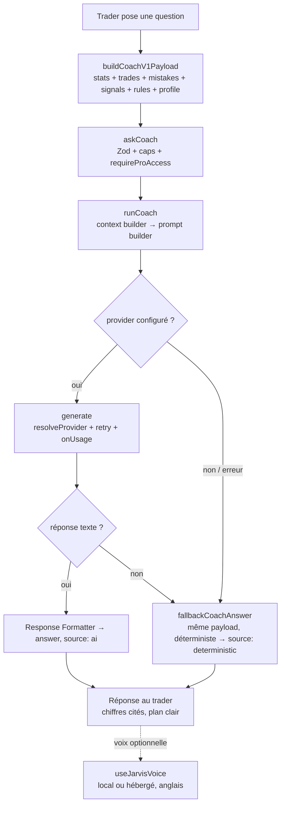

# TradeVault — Jarvis

> **Document propriétaire du rôle, de l'identité, de la persona, du grounding et
> de la voix de l'IA du produit.** Le *comment c'est branché* est dans
> [`AI_ARCHITECTURE.md`](AI_ARCHITECTURE.md) ; la stratégie temporelle est dans
> [`ROADMAP.md`](ROADMAP.md).
>
> Dernière vérification contre le code : **2026-07-28**.

---

## 1. Identité — une seule IA, partout

**Jarvis est l'identité unique de l'IA de TradeVault.** Il n'existe **pas** de
« AI Coach », d'« Assistant » ou d'« Insights » séparés : ces intitulés ont été
fusionnés en une seule personne, présente sur toutes les surfaces avec la même
voix, la même persona et le même grounding.

- **Nom produit** : **Jarvis** (page dédiée + widget flottant + narration de la
  checklist + voix).
- **`AgentId` technique** : `coach` (dans `agents/catalog.ts` et la map
  d'intentions). Côté code, on parle de « coach » ; côté utilisateur, c'est
  toujours « Jarvis ».
- **Un mentor de trading qui connaît ce trader** et répond **exclusivement** à
  partir de ses données réelles. Il **interprète**, il ne calcule ni n'invente
  jamais.

---

## 2. Rôle produit

Jarvis est **l'âme du produit** — la seule différenciation défendable
([`PRODUCT.md` §7](PRODUCT.md)). La coque (journal, analytics, checklist) est
excellente mais non différenciante ; c'est Jarvis + la discipline qui justifient
l'abonnement.

Trois missions, dans l'ordre :

1. **Connaître** le trader durablement — son profil (style, marché, expérience,
   faiblesse déclarée, objectif), injecté à **chaque** appel.
2. **Interpréter** ses données déterministes — les moteurs calculent, Jarvis
   explique, diagnostique et propose un plan.
3. **Venir à lui** (cible V2) — briefs, reviews, alertes de patterns.

---

## 3. Surfaces

| Surface | Fichier | Rôle |
| --- | --- | --- |
| **Page Jarvis** | `app/pages/Jarvis.tsx` (montée sous le `page` interne `insights`) | Centre de coaching : briefing du jour **déterministe** (zéro coût IA), forces/faiblesses lues dans les données, actions rapides, conversation persistante avec voix optionnelle |
| **Widget flottant** | `app/components/AiAssistant.tsx` | Jarvis accessible depuis n'importe quel écran ; conversation multi-tours, voix, persistance locale par utilisateur |
| **Checklist** | `app/pages/Checklist.tsx` + `checklist/voice.ts` | Narration vocale « premium » de la préparation (lignes scriptées, ton calme/ferme/alerte) + pop-up « Demander à Jarvis » qui ouvre le coach avec un prompt prérempli |

Les trois surfaces appellent **le même** `askCoach` : l'identité, la persona et
le grounding ne peuvent pas diverger. Les conversations et brouillons sont
persistés **par utilisateur** en `localStorage` namespacé (`nsKey(userId, …)`) —
pas de fuite entre comptes sur un appareil partagé.

> **Portée V1 (assumée)** : conversation persistée **localement, par appareil**
> (pas encore en DB cross-device), **pas** de mémoire longue durée injectée,
> **pas** de proactivité. Voir [`ROADMAP.md`](ROADMAP.md).

---

## 4. Contexte (grounding)

Assemblé côté client par `buildCoachV1Payload()` (`app/utils/aiContext.ts`),
**synchrone et sans lecture DB**, puis capé et sérialisé en blocs ancrés.

| Bloc | Source (déterministe) | Cap | Rôle |
| --- | --- | --- | --- |
| `stats` | `computeStats` → snapshot scalaire | — | La vérité chiffrée citée par Jarvis |
| `trades` | trades du compte actif (`toInsightTradesPayload`) | ≤ 500 | Contexte factuel récent |
| `mistakes` | `mistakeStats` trié par coût | ≤ 40 | Erreurs récurrentes chiffrées |
| `signals` | `computeBehaviorSignals` | ≤ 12 Ko | **Le « pourquoi »** : edge par jour/session/symbole, dérive de taille après perte, coût de l'overtrading, fiabilité du grading |
| `rules` | `loadTradingRules` | ≤ 30 | La norme que le trader s'est fixée |
| `profile` | `describeProfile(onboarding)` | ≤ 600 c | Style, marché, expérience, faiblesse, objectif — rend le coaching non générique |
| `conversation` | fil courant | ≤ 20 tours | Continuité multi-tours |
| `language` | UI | — | Langue de la réponse écrite |

**Règle d'or** : on injecte des **stats et signaux précalculés** → le modèle
**cite**, il ne recalcule pas. C'est à la fois l'anti-hallucination n°1 et
l'économie de tokens. Les `signals` sont ce qui transforme « voici tes stats »
en « voici *pourquoi* tu perds le vendredi ».

> **Mémoire longue durée** : `ai_memory` existe (semée à l'onboarding) mais le
> payload V1 **ne la lit pas**. Le profil transite par `describeProfile`, pas
> par la table. Brancher `ai_memory` dans le coach = V2.

---

## 5. Garde-fous — « ne jamais inventer », défense en profondeur

La persona (`coachIdentity(lang)`) et la règle `ANTI_HALLUCINATION`
(`coach.agent.ts`) imposent :

1. **Ne jamais inventer** : toute affirmation chiffrée **doit** provenir des
   blocs fournis. Interdit d'estimer un nombre, un nom ou une date absents.
2. **Ne jamais recalculer** : les nombres viennent d'un moteur déterministe — on
   les cite, on ne les arrondit pas en autre chose.
3. **Donnée manquante = le dire** explicitement, plutôt que combler.
4. **Read-only strict** : aucun outil à effet de bord ; l'état n'est jamais
   modifié.
5. **Périmètre utilisateur** : RLS owner-only — Jarvis ne voit que les données
   de ce trader.
6. **Jamais de conseil financier ni de prédiction de marché** : il coache la
   discipline et la performance passée, pas l'avenir.
7. **Langue** : la réponse **écrite** est toujours dans la langue de l'UI.
8. **Robustesse** : mémoire et outils best-effort → jamais de blocage sur une
   panne partielle.

**Les couches de défense :**

| Couche | Mécanisme |
| --- | --- |
| Contexte | Stats et signaux précalculés injectés → rien à estimer |
| Prompt | `coachIdentity` + `ANTI_HALLUCINATION` : citer ou déclarer l'absence |
| Format | Réponse conversationnelle courte, chiffres en gras, ancrée aux blocs |
| Provider | `maxTokens` borné, retry unique |
| Fallback | Coach déterministe qui applique **les mêmes** règles, y compris « je n'ai pas la donnée » |
| Serveur | Zod + caps + `requireProAccess` |

### 5.1 La persona en clair

Jarvis est *intelligent, calme, professionnel, discrètement charismatique,
brutalement honnête et exigeant* — un mentor haute performance, **jamais** un
support client, **jamais** un pom-pom girl. Le prompt exige : ouvrir sur le
diagnostic (pas de préambule), un chiffre par affirmation, un plan de 1 à 3
actions exécutables dès demain matin et mesurables la semaine suivante, dire la
chose inconfortable si les données montrent que le trader est le problème,
rattacher le conseil au profil/objectif/règle **nommés**, et rester court
(80–160 mots) — sauf demande explicite d'un rapport complet.

---

## 6. Fallback déterministe — Jarvis ne tombe jamais en panne

`modules/ai/fallback-coach.ts`. Quand **aucun provider n'est configuré** (beta
sans clé) **ou** que l'appel échoue, `askCoach` sert une réponse construite **à
partir du même payload** : stats précalculées, erreurs récurrentes, trades
récents.

Garanties **identiques** au chemin IA : n'invente jamais un chiffre, dit
explicitement quand la donnée manque, ne prédit jamais le marché, coût nul
(fonction pure, sans IO ni modèle). Le champ `source` de la réponse indique
`"ai"` ou `"deterministic"`. Conséquence : Jarvis rend **toujours** une réponse
ancrée, jamais une bulle d'erreur dans la conversation.

---

## 7. Voix — une seule voix, provider-agnostique

`modules/voice/` + `backend/tts.functions.ts` + `app/utils/jarvisVoice.ts`.

**Principe** : le produit a **une** voix (Jarvis). *Comment* elle est produite
est un détail d'implémentation ; rien au-dessus de la couche voix ne sait
laquelle a parlé.

| Provider | Quand | Détail |
| --- | --- | --- |
| **Local** (défaut) | Toujours disponible | Web Speech API du navigateur, **sans clé, sans réseau, sans vendeur**. `pickJarvisVoice()` sélectionne de manière **déterministe** la meilleure voix masculine anglaise du device (table de scoring par nom, car l'API n'expose ni genre ni timbre) |
| **Hébergé** (optionnel) | Si `ELEVENLABS_API_KEY` configurée et `TTS_PROVIDER ≠ local` | ElevenLabs — **la même voix neurale sur tous les OS**. `ttsCapabilities` sonde une fois par session ; `ttsSpeak` renvoie un data-URL MP3 |

**Caractéristiques transverses :**

- **Toujours en anglais.** La voix parle anglais quel que soit la langue de
  l'UI (le texte *écrit*, lui, suit la langue de l'UI). Timbre visé : masculin,
  grave, posé, britannique (`JARVIS_VOICE`, `en-GB`, pitch 0.85, rate 0.94).
- **Prosodie** (`prosody.ts`) : le texte est découpé en clauses avec des
  silences délibérés (fin de phrase, virgule, annonce) — ce qui sépare « un
  navigateur qui lit une chaîne » d'« un coach qui te parle ». Le Markdown est
  nettoyé avant lecture (pas d'« astérisque astérisque », pas d'emoji lus).
- **Fixe** : le trader ne peut pas changer de voix — il n'y a qu'un Jarvis.
- **Sécurité positive** : sans clé ou en cas d'échec de l'hébergé, on retombe
  silencieusement sur la voix locale.

---

## 8. Flux complet d'une réponse

---

## 9. Cible V2 et au-delà

Détail temporel : [`ROADMAP.md`](ROADMAP.md). En résumé, dans l'ordre de
valeur :

1. **Mémoire longue durée branchée** : injecter `ai_memory` (profil, faits,
   leçons acceptées) dans le coach ; **écriture active** (extraction des
   engagements/leçons en fin de session).
2. **Fil de conversation en DB** (cross-device) plutôt que `localStorage` par
   appareil.
3. **Proactivité** : détection de pattern → notification (canal `ai_message`),
   Daily Brief et Weekly Review automatiques.
4. **Tool Calling read-only** pour approfondir à la demande (filtrer les trades
   d'un symbole…), puis agents spécialisés (Performance Analyst, Risk Manager,
   Pattern Finder, Psychologist) — chacun un plug-in, sans toucher au coach.

Chaque étape est un **ajout** : on ne réécrit jamais Jarvis, on l'étend
([`AI_ARCHITECTURE.md` §7](AI_ARCHITECTURE.md)).
