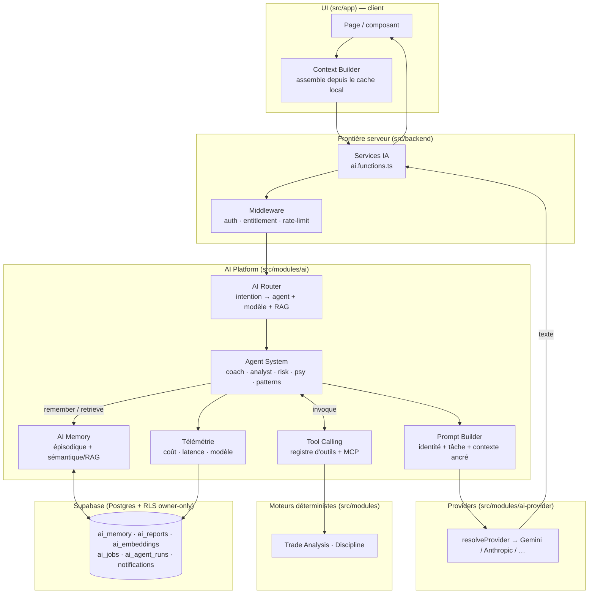
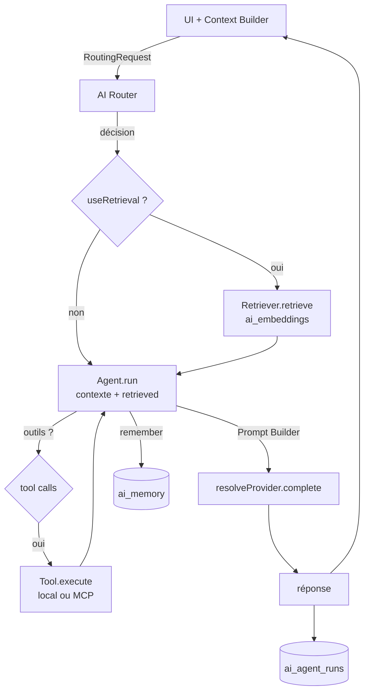
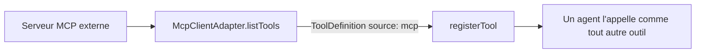

# TradeVault — Architecture de l'AI Platform

> **Blueprint technique de l'AI Platform.** Ce document conçoit l'architecture
> complète — une **plateforme**, pas un chatbot : router, mémoire, context
> builder, prompt builder, tool calling, agents, providers, services. Il décrit
> l'**architecture, les flux, les dossiers, les tables Supabase, les coûts et la
> sécurité**.
>
> **Deux compagnons, zéro duplication :**
> - **[`AI.md`](AI.md)** = *stratégie & roadmap 24 mois* (pourquoi / quand).
> - **Ici** = *comment c'est construit* (contrats, flux, données).
> - Priorités transverses : [`ROADMAP.md`](ROADMAP.md).
>
> **Légende d'état :** 🟢 Livré · 🟡 Fondation (contrats compilés, zéro runtime) · ⚪ Planifié.

---

## 1. Principe directeur

> **Une plateforme = des briques remplaçables derrière des contrats, reliées par
> un idiome unique : le registre de plug-ins.**

Un chatbot, c'est `question → LLM → réponse`. Une plateforme, c'est un **pipeline
gouverné** : intention → contexte → agent → outils → mémoire → télémétrie, où
chaque étage est **isolé, testable, remplaçable**, et où **ajouter une capacité =
enregistrer un plug-in**, jamais réécrire l'existant.

La couche provider le fait déjà (`resolveProvider()` : ajouter un modèle = 1
fichier + 1 ligne). L'AI Platform applique **le même patron** aux agents, outils,
jobs et à la RAG.

**Trois invariants (charte `CLAUDE.md`)**

- **Provider-agnostique** — l'app ne sait jamais quel modèle répond (chat *et*
  embeddings derrière une interface). Changer de modèle = une variable d'env.
- **Déterministe avant IA** — les moteurs purs (Trade Analysis, Discipline)
  calculent les chiffres ; l'IA les **interprète**, ne les recalcule jamais.
- **Ce qui survit au runtime va en DB (RLS owner-only)** — mémoire, embeddings,
  jobs, télémétrie, rapports.

---

## 2. Vue d'ensemble de l'architecture



**Sens des dépendances (invariant).** `app → backend → modules/ai →
ai-provider`. La couche `ai` ne connaît ni React ni le vendeur. Le bus
d'événements (`modules/events`) reçoit des payloads **primitifs** : la dépendance
pointe toujours `ai → core`, jamais l'inverse.

---

## 3. Les 8 sous-systèmes

### 3.1 Providers — 🟢 Livré

`src/modules/ai-provider/` — l'app ne parle jamais à un SDK vendeur.

- **Contrat** : `AIProvider.complete(AIRequest) → AIResponse`.
  `AIRequest { messages, maxTokens?, temperature?, json? }` ·
  `AIResponse { text, provider, model, usage? }` (`provider`/`usage` = télémétrie, jamais de branchement applicatif).
- **Résolution** : `resolveProvider()` → `AI_PROVIDER` si configuré, sinon premier provider configuré.
- **En place** : `gemini.ts`, `anthropic.ts`. **Ajouter OpenAI/Mistral/DeepSeek/Ollama** = 1 fichier + 1 ligne dans `registry.ts`.

### 3.2 Context Builder — 🟢 Livré

`src/modules/ai/context.ts` — assemble **tout ce que l'IA peut savoir** du trader,
**côté client** (là où la donnée vit déjà, en cache React Query), et le sérialise
en **blocs ancrés** citables.

- **`AIUserContext`** (champs optionnels, dégradation gracieuse) : `trades`,
  `stats` (précalculées par les moteurs), `goals`, `rules`, `memory`,
  `conversation`, `language`.
- **`contextBlocks(ctx)`** → sections étiquetées : `LONG-TERM MEMORY`,
  `THE TRADER'S OWN RULES`, `ACTIVE GOALS`, `PRECOMPUTED STATS (trust these numbers)`, `RECENT TRADES (JSON)`.
- **Grounding** : on injecte des **stats déterministes** → le modèle cite, il ne calcule pas (anti-hallucination + économie de tokens).

### 3.3 Prompt Builder — 🟢 Livré

`buildMessages()` (dans les services) — transforme *contexte + tâche + tour* en
`AIMessage[]`.

1. **System** = identité (coach qui *connaît* le trader, cite des chiffres réels,
   n'invente jamais, répond dans la langue de l'UI) **+ tâche** du service.
2. **Injection du contexte** (`contextBlocks`) en tête.
3. **Rejeu multi-tours** : contexte posé comme échange initial, puis les tours réels, puis la question.
4. **Format de sortie imposé** (Markdown structuré selon le service).

**24 mois** : externaliser les prompts en templates versionnés (A/B + éval),
identité par agent.

### 3.4 AI Router — 🟡 Fondation

`src/modules/ai/router/` — décide **quel agent**, **quel modèle**, **avec ou sans
RAG**. Séparé des agents → on fait évoluer le *quoi* sans toucher au *comment*.

- **Contrat** : `AIRouter.route(RoutingRequest) → RoutingDecision { agent, intent, model?, useRetrieval, reason? }`.
- **Map déterministe `INTENT_AGENT`** : `chat/analyze_trade/daily_brief → coach` ·
  `weekly_review/performance_review → performance-analyst` ·
  `detect_patterns → pattern-finder` · `psychology_check → psychologist` ·
  `assess_risk → risk-manager`.
- **24 mois** : arbitrage coût/qualité (modèle rapide pour le chat, premium pour la weekly review), A/B, fallback de modèle.

### 3.5 Agent System — 🟡 Fondation (déclaratif) · coach 🟢 via service

`src/modules/ai/agents/` — un plug-in par système IA. `catalog.ts` décrit **5
agents déclarativement** (persona, outils autorisés, format), `registry.ts` gère
`register/get/listReady`, `types.ts` porte `AgentDefinition.run()`.

| Agent | Rôle | Outils autorisés |
|---|---|---|
| `coach` | Mentor conversationnel (déjà servi via `aiChat`) | `get_stats`, `get_trades`, `search_memory`, `get_rules`, `get_goals` |
| `performance-analyst` | Lecture quant | `get_stats`, `get_trades`, `compute_quant_stats` |
| `psychologist` | Biais & tilt | `get_trades`, `search_memory`, `get_discipline_events` |
| `risk-manager` | Exposition & règles | `get_stats`, `get_rules`, `get_discipline_events`, `assess_trade_risk` |
| `pattern-finder` | Schémas récurrents | `get_trades`, `get_stats`, `search_memory` |

**Recette d'ajout** (rien d'existant modifié) : `agents/<x>.agent.ts` + `registerAgent()` + entrée `INTENT_AGENT` + (si besoin) job/RAG.

### 3.6 Tool Calling — 🟡 Fondation

`src/modules/ai/tools/` — capacités invocables par le modèle, provider-agnostique.
`ToolDefinition.execute()` + registre `registerTool()`.

- Un outil **réutilise les moteurs/stores** — jamais de logique métier dedans.
- Outils **permissionnés** (`sideEffect`) et **audités** (télémétrie).
- **MCP** (`src/modules/ai/mcp/`) passe par **le même contrat** : `McpClientAdapter.listTools` → `registerTool(source:"mcp")`. MCP = détail d'intégration, pas une bifurcation.

### 3.7 AI Memory — 🟢 épisodique · ⚪ sémantique (RAG)

`src/modules/ai/memory.ts` (table `ai_memory`) — ce qui fait que le coach
**connaît** le trader.

- **Épisodique** 🟢 : kinds `profile` / `fact` / `lesson` / `conversation` ;
  API `loadMemory` / `remember` / `forget`. RLS owner-only.
- **Sémantique (RAG)** ⚪ : `src/modules/ai/rag/` (`EmbeddingProvider` + `Retriever`) + table `ai_embeddings` (pgvector `vector(1536)` = **seul nombre couplé au modèle** d'embeddings).

### 3.8 Services — 🟢 Livré

`src/backend/ai.functions.ts` — chaque feature IA appelle une server function
(auth + entitlement + rate-limit en middleware). Recette unique :
**contexte validé (Zod) → prompt ancré → `resolveProvider().complete()`**.

`aiChat` · `aiGenerateDailyBrief` · `aiGenerateWeeklyReview` · `aiAnalyzeTrade` ·
`aiDetectPatterns` · `aiGenerateLessons`. Aucun nom de vendeur sous la couche provider.

**Télémétrie** (`telemetry.ts`, `AgentRun`) 🟡 : coût/latence/modèle par run, résumés non sensibles (jamais le prompt complet) → `ai_agent_runs`.

---

## 4. Flux

**A. Requête synchrone (chat / analyse)** — router → RAG → agent → outils → réponse



**B. Asynchrone (Daily Brief / Weekly Review / embeddings)**


**C. MCP — un outil externe devient local**



---

## 5. Dossiers

```
src/modules/ai/                ← LA PLATEFORME
  index.ts                     ← façade publique (AI.*) — la seule surface que l'UI importe
  context.ts        🟢         ← Context Builder (AIUserContext + contextBlocks)
  memory.ts         🟢         ← AI Memory épisodique (ai_memory)
  telemetry.ts      🟡         ← AgentRun (audit coût/latence/modèle)
  agents/                      ← Agent System
    types.ts · catalog.ts · registry.ts
  router/                      ← AI Router
    types.ts (AiIntent, INTENT_AGENT) · router.ts
  tools/  types.ts  🟡         ← Tool Calling (ToolDefinition + registre)
  rag/    types.ts  ⚪         ← RAG (EmbeddingProvider + Retriever)
  jobs/   types.ts  ⚪         ← Background Jobs (JobHandler + JobQueue)
  mcp/    types.ts  🟡         ← MCP (client/server adapters)

src/modules/ai-provider/       ← Providers (server-only)
  types.ts · registry.ts · gemini.ts · anthropic.ts · index.ts

src/backend/
  ai.functions.ts   🟢         ← Services (server functions)
  require-pro.ts    🟢         ← middleware entitlement + rate-limit

supabase/migrations/
  ..._ai_os_foundation.sql     ← ai_embeddings · ai_jobs · ai_agent_runs (prête, non appliquée)
```

Le Prompt Builder (`buildMessages`) vit aujourd'hui dans les services ; il sera
extrait en `prompts/` quand les templates seront versionnés (24 mois).

---

## 6. Tables Supabase

Toutes en **RLS owner-only** (`user_id = auth.uid()`), migrations **additives**.

| Table | Rôle | État |
|---|---|---|
| `ai_memory` | Mémoire épisodique (profile/fact/lesson/conversation) | 🟢 |
| `ai_reports` | Briefs quotidiens / reviews hebdo générés | 🟢 |
| `ai_rate_limits` + `consume_ai_quota()` | Compteur horaire atomique par utilisateur | 🟢 |
| `notifications` | Inbox + canal `ai_message` | 🟢 |
| `ai_embeddings` | Vecteurs pgvector des artefacts (RAG) | ⚪ (migration prête) |
| `ai_jobs` | File de tâches async (statut, payload, retry) | ⚪ (migration prête) |
| `ai_agent_runs` | Journal d'audit par invocation d'agent | ⚪ (migration prête) |

> `vector(1536)` (embeddings) est **le seul nombre couplé au modèle** ; changer de
> provider d'embeddings = ajuster la dimension + le provider.

---

## 7. Coûts

**Contrôles en place** 🟢 :
- **Rate-limit par utilisateur** — `consume_ai_quota` (fenêtre fixe atomique SQL), défaut 60/h, **fail-open** sur erreur infra.
- **Budgets de tokens** — `maxTokens` par service (chat 4096, brief 1024…).
- **Grounding compact** — stats précalculées plutôt que trades bruts (moins de tokens, plus de précision).
- **Caps d'entrée Zod** — trades ≤ 500, mémoire ≤ 60, conversation ≤ 20.
- **Provider bon marché par défaut** — Gemini en primaire.

**À construire** ⚪ :
- **Télémétrie attribuable** (`ai_agent_runs`) — coût/latence/modèle par utilisateur dès le 1ᵉʳ run.
- **Arbitrage de modèle par le router** — rapide/pas cher vs premium.
- **Jobs asynchrones** — l'IA lourde hors du chemin requête, batchable.
- **Compaction mémoire / RAG** — borner la croissance du contexte.
- **Quotas différenciés Free/Pro** — le rate-limit devient aussi un levier produit.

---

## 8. Sécurité

| Garde-fou | État | Détail |
|---|---|---|
| Secrets serveur-only | 🟢 | Clés via `process.env` dans `backend/` ; rien côté client |
| Auth obligatoire | 🟢 | `requireSupabaseAuth` avant tout endpoint IA |
| Entitlement | 🟢 | `requireProAccess` derrière `AI_REQUIRE_PRO` (OFF en beta) ; fail-open infra, fail-closed au payant |
| Rate-limit anti-abus | 🟢 | `consume_ai_quota`, indépendant du paywall |
| Validation d'entrée | 🟢 | Schémas Zod stricts + caps de taille |
| RLS owner-only | 🟢 | Toutes les tables `ai_*` isolées par utilisateur |
| Anti-hallucination | 🟢 | Grounding chiffres réels, interdiction d'inventer, format contraint |
| Outils permissionnés & audités | 🟡 | `sideEffect` + télémétrie (à l'implémentation du Tool Calling) |
| Données MCP externes | ⚪ | Traiter comme input non fiable (validation stricte des sorties d'outils) |

---

## 9. Pourquoi cette architecture (bénéfices)

- **Registres partout** (agents/tools/jobs/providers) → *open/closed* : chaque système isolé, testable seul, ajout sans modifier l'existant.
- **Router séparé des agents** → évolution du routage/modèle sans toucher aux agents.
- **Tool Calling = abstraction unique** → local et MCP par le même contrat, permissionnés et audités.
- **RAG derrière `EmbeddingProvider`** → provider d'embeddings interchangeable ; vecteurs en pgvector RLS owner-only.
- **Jobs table-backed** → l'IA coûteuse ne bloque jamais une requête ; durable, retryable.
- **Télémétrie de première classe** → gouvernance de coût par utilisateur dès le départ.
- **Déterministe avant IA** → chiffres exacts et reproductibles, l'IA n'apporte que l'interprétation.

---

## 10. État & ordre de construction

- **Fait** 🟢 : Providers, Context Builder, Prompt Builder, AI Memory épisodique, Services (coach + briefs + reviews + patterns + lessons), rate-limit/entitlement.
- **Fondation** 🟡 : Router, Agent System (déclaratif), Tool Calling, MCP, télémétrie — contrats compilés, zéro logique runtime.
- **Planifié** ⚪ : RAG, Jobs, migration `ai_os_foundation`, agents spécialisés.

**Ordre recommandé** (par valeur) : (1) Tool Calling + coach sur le provider
existant, (2) RAG (embeddings trades/notes), (3) Jobs (Daily Brief / Weekly
Review), (4) Performance Analyst + Risk Manager, (5) Psychologist, (6) MCP.
Détail temporel dans [`AI.md`](AI.md).

_Document de conception — aucune implémentation. « Ajouter un système IA » ne
modifie jamais un agent, un service ou un moteur existant : c'est la garantie
structurelle d'une plateforme._
