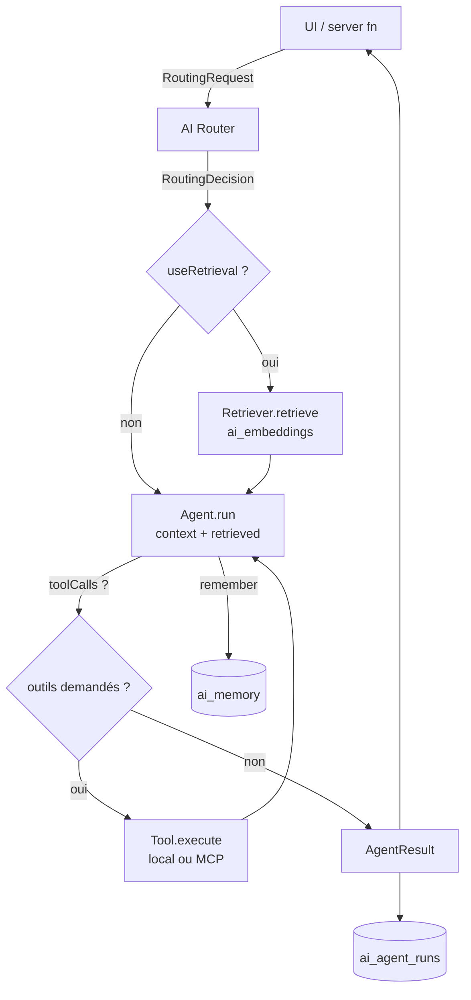
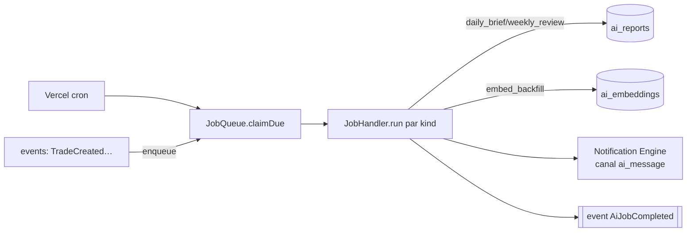
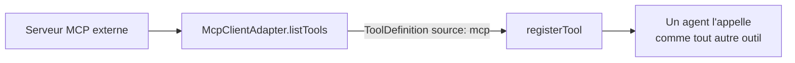

# TradeVault — Architecture de l'AI Operating System

> **Fondations préparées, non implémentées.** Ce document décrit l'ossature qui
> permet d'ajouter chaque système IA **indépendamment**, sans réécrire
> l'existant. Aucune fonctionnalité IA n'est développée à ce stade : ce sont
> des **contrats** (interfaces, types, registres, modèles de données).
>
> À lire avec [`ARCHITECTURE.md`](ARCHITECTURE.md) (les 5 moteurs + le bus).

## 1. Principe directeur

Un seul idiome, répété partout : **le registre de plug-ins**. La couche
provider IA existante le fait déjà (`resolveProvider()` : ajouter un modèle =
1 fichier + 1 ligne). L'AI OS applique **exactement le même patron** aux
agents, aux outils, aux jobs et à la RAG.

> **Conséquence :** ajouter l'« AI Psychologist » = écrire un fichier agent et
> l'enregistrer. Aucun autre agent, aucune page, aucun moteur n'est touché.
> C'est l'objectif « chaque système IA ajoutable indépendamment » rendu
> structurel, pas seulement documentaire.

Trois invariants hérités de la charte :

- **Provider-agnostique** : l'app ne sait jamais quel modèle répond (chat
  **et** embeddings passent par une interface).
- **Moteurs déterministes en amont de l'IA** : Risk Manager & Performance
  Analyst **interprètent** les sorties des moteurs purs (Analysis/Discipline),
  ils ne recalculent jamais les scores.
- **Ce qui survit au runtime va en DB avec RLS owner-only** : mémoire,
  embeddings, jobs, télémétrie.

## 2. Organisation des dossiers

```
src/modules/ai/
  index.ts                 ← façade publique (AI.*) + ré-exports des contrats
  context.ts               ← AIUserContext (existant)
  memory.ts                ← mémoire épisodique (existant : ai_memory)
  agents/                  ← ★ un plug-in par système IA
    types.ts               ←   AgentDefinition / AgentRequest / AgentResult
    catalog.ts             ←   AGENT_CATALOG : les 5 blueprints (métadonnées)
    registry.ts            ←   registre runtime (register/get/listReady)
  router/                  ← ★ orchestrateur : intention → agent
    types.ts               ←   AIRouter, AiIntent, INTENT_AGENT (map déterministe)
    router.ts              ←   routeur par défaut (intents explicites)
  tools/                   ← ★ Tool Calling provider-agnostique
    types.ts               ←   ToolDefinition / ToolCall / registre d'outils
  rag/                     ← ★ Retrieval-Augmented Generation
    types.ts               ←   EmbeddingProvider / Retriever / RagDocument
  jobs/                    ← ★ Background Jobs (async, durable, retry)
    types.ts               ←   JobHandler / JobQueue / registre de handlers
  mcp/                     ← ★ Model Context Protocol (client + server)
    types.ts               ←   McpClientAdapter / McpServerExposer
  telemetry.ts             ← ★ AgentRun (audit : coût, latence, modèle)

src/modules/core/
  ai-provider/             ← couche modèle (existant : Gemini, Anthropic…)
  events/types.ts          ← + événements AI OS (additif)

supabase/migrations/
  ..._ai_os_foundation.sql ← ai_embeddings (pgvector) · ai_jobs · ai_agent_runs
```

Chaque dossier `★` est un point d'extension autonome. La couche `tradevault/`
(UI) n'importe que la **façade** `@/modules/ai` — jamais l'intérieur.

## 3. Les briques (contrats)

| Système | Rôle | Interface clé | Extension |
|---|---|---|---|
| **AI Router** | Décide quel agent traite une intention, orchestre RAG + tools | `AIRouter.route()` | `INTENT_AGENT` (config) |
| **Agents** | Coach, Performance Analyst, Psychologist, Risk Manager, Pattern Finder | `AgentDefinition.run()` | `registerAgent()` |
| **AI Memory** | Épisodique (faits/leçons) + sémantique (RAG) | `remember()` / `Retriever` | `ai_memory`, `ai_embeddings` |
| **Tool Calling** | Capacités que le modèle peut invoquer | `ToolDefinition.execute()` | `registerTool()` |
| **RAG** | Indexe et retrouve les artefacts du trader | `EmbeddingProvider` + `Retriever` | provider d'embeddings |
| **Background Jobs** | Brief nocturne, review hebdo, embeddings, scans | `JobHandler.run()` | `registerJobHandler()` |
| **MCP** | Bridge outils externes ↔ outils locaux | `McpClientAdapter` / `McpServerExposer` | `source: "mcp"` |
| **Notifications IA** | Canal `ai_message` du Notification Engine (existant) | event `AiNotificationRequested` | listener |
| **Daily Brief / Weekly Review** | Rapports générés | `JobKind` + `ai_reports` (existant) | job handler |
| **Télémétrie** | Audit coût/latence/modèle | `TelemetryRecorder.record()` | `ai_agent_runs` |

Les cinq **agents** sont déjà décrits **déclarativement** dans
`agents/catalog.ts` (titre, persona, outils autorisés, format de sortie) — une
source de vérité produit/technique, sans aucune logique IA.

## 4. Modèles de données (migration additive)

| Table | Rôle | RLS |
|---|---|---|
| `ai_embeddings` | Vecteurs (pgvector) des artefacts du trader pour la RAG | select owner ; écriture serveur |
| `ai_jobs` | File de tâches asynchrones (statut, payload, retry) | select owner ; opérations serveur |
| `ai_agent_runs` | Journal d'audit de chaque invocation d'agent | select owner ; écriture serveur |
| `ai_memory` *(existant)* | Mémoire épisodique (profil/faits/leçons/conv.) | owner-only |
| `ai_reports` *(existant)* | Briefs quotidiens / reviews hebdo | owner-only |
| `notifications` *(existant)* | Inbox + canal `ai_message` | owner-only |

> `vector(1536)` est le **seul nombre couplé au modèle** d'embeddings ;
> changer de provider = ajuster cette dimension + le provider.

## 5. Flux de données

**Requête IA (chat / analyse) — boucle routeur → RAG → agent → outils**



**Travail asynchrone — Daily Brief / Weekly Review / embeddings**



**MCP — un outil externe devient un outil local**



## 6. Ajouter un système IA (recette)

1. **Agent** : écrire `agents/<x>.agent.ts` implémentant `AgentDefinition`
   (persona depuis `AGENT_CATALOG`, `run()` qui appelle `resolveProvider()`),
   puis `registerAgent(x)`.
2. **Outils** : `registerTool()` pour chaque capacité, en réutilisant les
   moteurs/stores existants (jamais de logique métier dans l'outil).
3. **Intention** : câbler l'`AiIntent` → agent dans `INTENT_AGENT`.
4. **Async** (si besoin) : `registerJobHandler()` + `enqueue` depuis un cron
   ou un événement.
5. **RAG** (si besoin) : implémenter un `EmbeddingProvider` + `Retriever`.

Aucune de ces étapes ne modifie un agent ou un moteur existant.

## 7. Choix d'architecture & avantages

- **Registres partout (agents/tools/jobs/providers)** → *open/closed* : ouvert
  à l'extension, fermé à la modification. Chaque système IA est isolé et
  testable seul. C'est la garantie « ajout indépendant ».
- **Router séparé des agents** → on fait évoluer le *quoi* (intentions,
  arbitrage de modèle, A/B) sans toucher au *comment* (agents).
- **Tool Calling comme abstraction unique** → local et MCP passent par le même
  contrat : MCP devient un détail d'intégration, pas une bifurcation d'archi.
  Les outils sont **permissionnés** (`sideEffect`) et **audités**.
- **RAG derrière `EmbeddingProvider`** (comme le chat) → provider d'embeddings
  interchangeable ; vecteurs en pgvector avec RLS owner-only (isolation stricte
  par utilisateur, indispensable pour des données de trading privées).
- **Background Jobs table-backed** → l'IA coûteuse et longue ne bloque jamais
  une requête ; durable, retryable, déclenchée par le cron existant.
- **Télémétrie de première classe** → coût/latence/modèle observables et
  attribuables dès le premier run : base d'une gouvernance de coût par
  utilisateur (couplée au rate-limit IA déjà en place).
- **Événements primitifs dans `core`** → le bus reste indépendant de
  `modules/ai` ; la dépendance pointe toujours `ai → core`, jamais l'inverse.
- **Déterministe avant IA** → Risk/Performance interprètent les moteurs purs,
  garantissant des chiffres exacts et reproductibles, l'IA n'apportant que
  l'interprétation.

## 8. État & prochaines étapes

- **Fait (fondation) :** tous les contrats, registres et le catalogue d'agents
  compilent ; la migration de données est prête (non appliquée).
- **Non fait (volontairement) :** aucun agent, outil, retriever, job ou routeur
  IA n'a de logique — ce sera l'objet des lots suivants, un système à la fois.
- **Ordre recommandé** (par valeur) : (1) Tool Calling + Coach sur le provider
  existant, (2) RAG (embeddings des trades/notes), (3) Jobs (Daily Brief),
  (4) Performance Analyst + Risk Manager sur les moteurs, (5) Psychologist,
  (6) MCP.
