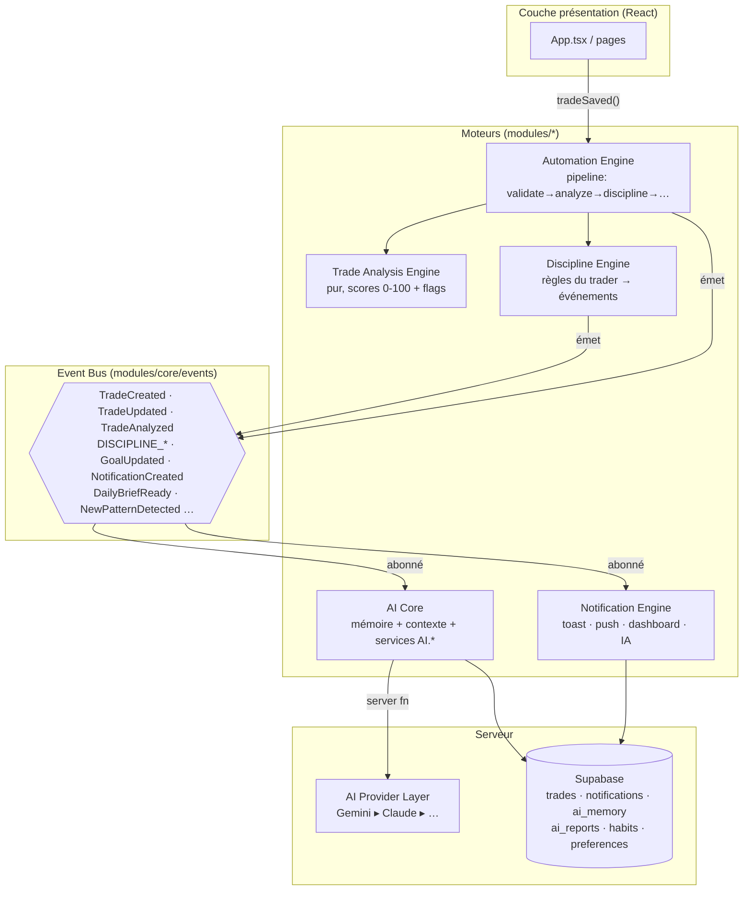

# TradeVault — Architecture des moteurs

> Fondations techniques de l'« AI Trading Operating System ». Toute nouvelle
> fonctionnalité DOIT s'appuyer sur ces moteurs — aucune logique métier dans
> les composants React.

## Vue d'ensemble

```
src/
  modules/                    ← cœur de l'architecture (framework-agnostic)
    core/
      events/                 ← Event Bus typé (le système nerveux)
      ai-provider/            ← abstraction multi-fournisseurs IA (server-only)
      db.ts                   ← accès typé aux nouvelles tables (temporaire)
    trading/
      analysis/               ← Trade Analysis Engine (pur, déterministe)
    discipline/               ← Discipline Engine (événementiel)
    automation/               ← Automation Engine (pipeline extensible)
    notifications/            ← Notification Engine (canal unique)
    ai/                       ← AI Core (contexte, mémoire, services AI.*)
  lib/
    ai.functions.ts           ← services AI Core exposés en server functions
    ai-insights.functions.ts  ← endpoint historique, re-plateformé sur le provider
  tradevault/                 ← couche présentation (pages, composants, contexts)
```

**Règle d'or** : `tradevault/` (UI) importe `modules/` — jamais l'inverse.
Les moteurs ne connaissent ni React, ni Supabase directement (adapters
injectés), ni le fournisseur IA (couche provider).

## Les 5 moteurs



### 1. AI Core (`modules/ai` + `lib/ai.functions.ts`)

- **Services** : `AI.chat`, `AI.generateDailyBrief`, `AI.generateWeeklyReview`,
  `AI.analyzeTrade`, `AI.detectPatterns`, `AI.generateLessons`.
- **Contexte complet** (`AIUserContext`) : trades, stats précalculées, objectifs,
  règles perso, mémoire long terme, historique de conversation, langue.
- **Mémoire persistante** (`ai_memory`) : `profile` (qui est le trader),
  `fact` (observations durables), `lesson` (leçons acceptées),
  `conversation` (fenêtre de chat). Chaque appel part en connaissant déjà
  l'utilisateur.
- Pas un chatbot : les services sont conçus pour être déclenchés par les
  événements (brief du matin, review hebdo, analyse post-trade).

### 2. Trade Analysis Engine (`modules/trading/analysis`)

- `analyzeTrade(trade, ctx)` → `TradeAnalysis` : `riskPct`, `rrScore`,
  `setupScore`, `disciplineScore`, `executionScore` (MAE/MFE/slippage),
  score composite 0-100, grade A-F, flags typés.
- **Zéro IA, zéro IO** : pur et déterministe → testable, exécutable partout.
- L'IA consomme cet objet (elle interprète, ne recalcule jamais).

### 3. Discipline Engine (`modules/discipline`)

- Source de vérité unique : les règles écrites par le trader
  (`profiles.trading_rules`, évaluées par `checkTradeAgainstRules`).
- Émet `DISCIPLINE_WARNING` (règle souple), `DISCIPLINE_LIMIT_REACHED`
  (limite dure : sur-risque, stop-après-pertes), `DISCIPLINE_SUCCESS`
  (journée propre — le succès est un événement, pas un silence).
- Aucune page n'évalue une règle elle-même.

### 4. Automation Engine (`modules/automation`)

- Pipeline ordonné d'étapes nommées, isolées en erreur :
  `validate(10) → analyze(20) → discipline(30) → [futures étapes]`.
- `registerStep({name, order, run})` : toute nouvelle automatisation est un
  plug-in — personne ne réécrit la chaîne.
- Entrée unique : `AutomationEngine.tradeSaved(ctx)` appelé par l'UI après la
  persistance (fire-and-forget, l'optimistic UI n'attend jamais).

### 5. Notification Engine (`modules/notifications`)

- Entonnoir unique : `NotificationEngine.notify(userId, input)` → canaux
  `toast` / `push` / `dashboard` (persistée) / `ai_message`.
- Les canaux sont des **adapters injectés** au bootstrap (`configure()`),
  le moteur n'importe ni React ni server functions.
- Abonné au bus : les événements discipline deviennent des notifications ICI,
  plus dans les pages.

## Event Bus (`modules/core/events`)

- Typé de bout en bout (`DomainEvents`), handlers isolés en erreur,
  `on()` retourne l'unsubscribe.
- Portée : **par runtime** (onglet navigateur / invocation serveur). La
  livraison cross-device passe par les notifications persistées, pas par le bus.

## AI Provider Layer (`modules/core/ai-provider`)

- Interface `AIProvider { id, isConfigured(), complete(req) }`.
- `resolveProvider()` : `AI_PROVIDER` env → sinon premier provider configuré.
- Fournisseurs : **Gemini** (actif, `GEMINI_API_KEY`), **Anthropic** (prêt,
  `ANTHROPIC_API_KEY`). Ajouter OpenAI/Mistral/Ollama = 1 fichier + 1 ligne.
- **L'application ne sait jamais quel modèle répond.**

## Flux de données

**Sauvegarde d'un trade**

```
UI (optimistic) → upsertTrade (DB) → AutomationEngine.tradeSaved
  → émet TradeCreated/Updated
  → step analyze  → TradeAnalysis → émet TradeAnalyzed
  → step discipline → violations → émet DISCIPLINE_*
      → NotificationEngine (abonné) → toast + push + insert notifications
```

**Question au coach IA**

```
UI → AI.chat (server fn, auth requise)
  → AIUserContext (trades + stats + règles + mémoire + conversation)
  → contextBlocks() → prompt ancré → resolveProvider().complete()
  → réponse citée sur les vraies données
```

## Base de données (migration `20260718120000_engines_foundation.sql`)

100 % additive — aucune table existante modifiée, aucune donnée cassée.

| Table              | Rôle                                                            | Moteur        |
| ------------------ | --------------------------------------------------------------- | ------------- |
| `notifications`    | inbox dashboard + trace des alertes                             | Notifications |
| `ai_memory`        | mémoire long terme (profile/fact/lesson/conversation)           | AI Core       |
| `ai_reports`       | briefs quotidiens, reviews hebdo, analyses (unique par période) | AI Core       |
| `user_preferences` | préférences JSONB extensibles                                   | tous          |
| `habits`           | habitudes suivies (streaks)                                     | Discipline/AI |

RLS owner-only sur chaque table (patron identique aux migrations existantes).

## Dettes techniques restantes

1. **Types Supabase générés** : les nouvelles tables ne sont pas dans
   `integrations/supabase/types.ts` → `modules/core/db.ts` relâche le typage
   (RLS intacte). À régénérer, puis supprimer `db.ts`.
2. **Tests unitaires des moteurs** : les engines purs (analysis, discipline)
   sont conçus pour être testés — les specs restent à écrire.
3. **i18n des messages moteurs** : les textes émis par les moteurs (analysis
   flags, notifications succès) sont en anglais ; le système i18n vit dans la
   couche UI. À arbitrer (clés i18n dans les payloads vs texte serveur).
4. **Inbox notifications** : la table + le moteur existent, l'UI de l'inbox
   n'est volontairement pas construite (mission = fondations, pas d'UI).
5. **`src/tradevault/` reste monolithique** : la couche présentation migrera
   vers `modules/*/components` progressivement (strangler), page par page.
6. **Bus serveur** : les server functions n'émettent pas encore d'événements
   croisés (chaque invocation est isolée) — un outbox pattern via
   `notifications`/`ai_reports` couvrira les besoins cross-runtime.

## Prochaines étapes les plus rentables

1. **Daily Brief sur le Dashboard** (~1 j) : `AI.generateDailyBrief` +
   `ai_reports` sont prêts — il ne manque que la carte UI. Valeur perçue
   immédiate, difficile à copier.
2. **Inbox de notifications** (badge + panneau) : le backend est complet.
3. **Debrief IA post-trade** : câbler `AI.analyzeTrade` en étape d'automation
   (ordre 40) sur les trades A-/F pour un retour mentor instantané.
4. **Page « Patterns »** : `AI.detectPatterns` retourne du JSON structuré —
   il suffit d'une grille de cartes.
5. **Mémoire auto-alimentée** : après chaque review hebdo, `remember()` les
   leçons acceptées → le coach devient réellement personnel.

## Garanties d'évolutivité

- **Nouvelle fonctionnalité = nouvel événement + nouveau listener/step** :
  on n'édite jamais un moteur existant pour en brancher un nouveau.
- **Changement de modèle IA = variable d'env**, zéro refactor.
- **Scores d'analyse versionnables** : `TradeAnalysis.computedAt` + flags à
  codes stables permettent la ré-analyse batch.
- **Multi-device ready** : tout ce qui doit survivre au runtime est en DB
  (notifications, mémoire, rapports) avec RLS.
