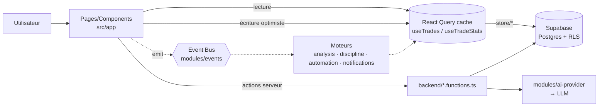

# TradeVault — Architecture

> **But de ce document** : permettre à un développeur (humain ou agent IA) de
> comprendre le projet **en moins de 30 minutes**. Il décrit la structure réelle
> du dépôt, les responsabilités de chaque dossier, le flux de données, les
> conventions, et les points de contact avec Supabase.
>
> À lire aussi : [`CLAUDE.md`](../CLAUDE.md) (charte de l'équipe, non
> négociable), [`docs/AI-ARCHITECTURE.md`](AI-ARCHITECTURE.md) (le détail du
> cœur IA), [`docs/ux-architecture.md`](ux-architecture.md) (l'UX),
> [`docs/ROADMAP.md`](ROADMAP.md) (audit + priorités P0–P3).

---

## 1. En une minute

TradeVault est un **journal de trading enrichi à l'IA** (« AI Trading Operating
System »). Un trader logge ses trades ; l'app calcule des stats de niveau quant
(Sharpe, Sortino, expectancy, drawdown), affiche un calendrier économique, une
checklist de discipline pré-marché, et un coach IA qui interprète ses données.

- **Front** : SPA React 19 servie par **TanStack Start** (SSR shell + hydratation).
- **Back** : **server functions** TanStack (`createServerFn`) — pas d'API REST séparée.
- **Données** : **Supabase** (Postgres + Auth + Storage), sécurisé par **RLS owner-only**.
- **Runtime** : **Bun**, build **Vite**, déployé sur **Vercel** (adaptateur Nitro).

**Règle d'or de l'architecture** : la couche UI (`src/app/`) importe les moteurs
(`src/modules/`) — **jamais l'inverse**. Aucune logique métier dans les
composants React.

---

## 2. Structure du projet

```
src/
├── routes/              ← Routing fichier TanStack (le SEUL routeur réel)
│   ├── __root.tsx       ← shell de l'app (head, error boundary, providers)
│   ├── index.tsx        ← "/" → monte <App/> (toute l'app authentifiée)
│   ├── privacy.tsx · terms.tsx · reset-password.tsx
│   └── README.md        ← conventions de routing
│
├── app/                 ← COUCHE PRÉSENTATION (React) — ex-`tradevault/`
│   ├── App.tsx          ← orchestrateur : auth, navigation interne, data
│   ├── types.ts         ← types métier partagés (Trade, TradeStats, Page…)
│   ├── store.ts         ← barrel de persistance (ré-exporte store/*)
│   ├── store/           ← accès Supabase découpé par domaine
│   ├── pages/           ← une vue par page (Dashboard, Journal, Analytics…)
│   ├── components/      ← composants réutilisables (modals, charts, nav…)
│   ├── hooks/           ← hooks React (data, stats, realtime, push…)
│   ├── contexts/        ← providers transverses (Auth, Theme, Toast…)
│   ├── utils/           ← calculs purs & helpers (stats, positions, CSV…)
│   ├── i18n/            ← internationalisation (LanguageContext + locales)
│   └── onboarding/      ← premier lancement (wizard + copy)
│
├── modules/             ← MOTEURS (framework-agnostic, sans React ni IO direct)
│   ├── events/          ← Event Bus typé (le système nerveux)
│   ├── trading/analysis ← Trade Analysis Engine (pur, déterministe)
│   ├── discipline/      ← Discipline Engine (règles → événements)
│   ├── automation/      ← Automation Engine (pipeline de steps)
│   ├── notifications/   ← Notification Engine (toast · push · dashboard)
│   ├── ai/              ← AI Core (contexte, mémoire, services AI.*)
│   └── ai-provider/     ← abstraction multi-fournisseurs IA (provider-agnostique)
│
├── backend/             ← FRONTIÈRE SERVEUR (server-only ; secrets ici)
│   ├── *.functions.ts   ← server functions appelables par l'UI
│   ├── *.server.ts      ← helpers serveur internes (billing, emails, crons)
│   ├── require-pro.ts   ← middleware de gating (flag AI_REQUIRE_PRO)
│   └── README.md        ← convention .functions.ts vs .server.ts
│
├── integrations/supabase← client Supabase + types générés + auth middleware
├── shared/              ← utilitaires bas niveau partagés client/serveur
└── assets/              ← images importées par le bundle

Racine : supabase/migrations · public/ · scripts/ · tests/ · docs/
```

### Sens des dépendances (invariant)

```
routes/  →  app/  →  modules/         (UI consomme les moteurs)
   │         │
   │         └────→  backend/*.functions.ts   (UI appelle le serveur)
   │
backend/ →  modules/  +  integrations/supabase   (serveur exécute les moteurs)

modules/ ne dépend JAMAIS de app/ ni de React.   ⚠️ invariant à préserver
```

---

## 3. Responsabilités des dossiers

| Dossier | Responsabilité | Peut importer | Ne doit PAS importer |
|---|---|---|---|
| `src/routes/` | Routing fichier TanStack, shell HTML, SEO/meta, error boundaries | `app/`, `shared/` | logique métier |
| `src/app/` | Tout le rendu et l'état côté client | `modules/`, `backend/*.functions.ts`, `integrations/` | — |
| `src/modules/` | Moteurs métier purs, réutilisables, testables | autres `modules/`, `app/types` (kernel) | `app/` (UI), React, secrets |
| `src/backend/` | Exécution serveur, secrets, crons, emails, paiement | `modules/`, `integrations/`, `process.env` | code client |
| `src/integrations/supabase/` | Client Supabase typé, attache auth, middleware | `shared/` | `app/` |
| `src/shared/` | Helpers neutres (capture d'erreur, zoom lock) | rien de métier | `app/`, `modules/` |

> **Dette connue** : quelques modules importent encore `@/app/types` et un ou
> deux utilitaires UI (`generateId`, `tradingRules`). C'est le principal point
> de nettoyage identifié dans [`ROADMAP.md`](ROADMAP.md) — extraire un
> `src/domain/` kernel. Documenté, non bloquant.

---

## 4. Flux de données

### 4.1 Vue d'ensemble



### 4.2 Cycle de vie d'un trade (chemin critique)

1. L'utilisateur sauve un trade dans `TradeModal`.
2. `App.tsx` fait une **écriture optimiste** : `queryClient.setQueryData` met à
   jour le cache **immédiatement** (l'UI n'attend jamais le réseau — cf. axe
   « Performance » de la charte).
3. En parallèle, `store/trades.ts` (`upsertTrade`) persiste dans Supabase.
4. `AutomationEngine` orchestre un pipeline de steps : `validate → analyze
   (Trade Analysis Engine) → discipline → notifications`.
5. Les moteurs communiquent **uniquement via l'Event Bus** (`TradeCreated`,
   `TradeAnalyzed`, `DISCIPLINE_*`…). Aucun moteur n'appelle un autre en direct.
6. Le `NotificationEngine` route le résultat vers le bon canal (toast, push,
   dashboard) ; ce qui doit survivre au runtime est persisté (RLS owner-only).

### 4.3 Lecture

- Les trades vivent dans le **cache React Query**, clé `["trades", userId,
  accountId]`. Changer de sous-compte = refetch keyé ; revenir = instantané.
- `useTradeStats` dérive **toutes** les statistiques du tableau de trades en
  mémoire (fonctions pures de `utils/`) — pas d'aller-retour serveur, pas de N+1.
- `useRealtimeProfile` s'abonne aux changements Supabase Realtime (multi-onglets).

### 4.4 Données qui traversent la frontière serveur

Rapports mensuels, coaching IA, push, billing passent par
`backend/*.functions.ts`. Les secrets (clés API, tokens LLM, clés Stripe/crypto)
restent **côté serveur**, lus via `process.env`. Aucune clé n'atteint le client.

---

## 5. Conventions de nommage

| Élément | Convention | Exemple |
|---|---|---|
| Composant React | `PascalCase.tsx`, un export default | `TradeModal.tsx` |
| Page | `PascalCase.tsx` dans `app/pages/` | `Analytics.tsx` |
| Hook | `useXxx.ts`, camelCase | `useTradeStats.ts` |
| Contexte | `XxxContext.tsx` + provider `XxxProvider` | `AuthContext.tsx` |
| Utilitaire pur | `camelCase.ts` | `positionCalc.ts` |
| Server function (UI-appelable) | `*.functions.ts` | `ai.functions.ts` |
| Helper serveur interne | `*.server.ts` | `billing.server.ts` |
| Moteur (public) | `index.ts` ré-exporte l'API ; `engine.ts` l'impl ; `types.ts` les types | `modules/discipline/*` |
| Alias d'import | `@/` = `src/` (voir `tsconfig.json`) | `@/modules/events` |
| Migration Supabase | `AAAAMMJJHHMMSS_description.sql`, **additive** | `20260718160000_ai_os_foundation.sql` |

**Règles transverses**
- Imports internes à `app/` en relatif (`./components/…`) ; cross-couche via `@/`.
- Un dossier de moteur expose sa surface publique par `index.ts` — les
  importeurs ne touchent jamais `engine.ts`/`types.ts` en direct.
- Migrations **jamais destructives** (ne casse ni table ni donnée existante).

---

## 6. Composants (`src/app/components/`)

Composants transverses, réutilisés par plusieurs pages. Les vues complètes
vivent dans `pages/` ; les sous-composants spécifiques à une page lourde sont
co-localisés (ex. `pages/landing/`, `pages/checklist/`, `pages/goals/`).

| Composant | Rôle |
|---|---|
| `Sidebar` · `MobileNav` | Navigation (desktop / mobile) |
| `TradeModal` · `TradeDetailModal` | Création/édition & détail d'un trade |
| `EquityChart` · `StatsCard` | Visualisation (Recharts) & KPI |
| `AiAssistant` · `MarkdownAnswer` | Coach IA & rendu markdown des réponses |
| `CommandPalette` | Palette ⌘K (cmdk) |
| `ImportCsvModal` | Import de trades depuis CSV broker |
| `AccountSwitcher` | Bascule entre sous-comptes |
| `PushNotificationSettings` · `PushOnboardingBanner` | Web-push |
| `ThemeSettings` · `CursorGlow` · `Lightbox` · `Skeleton` | UI / thème / skeletons |
| `TradingRulesSection` · `SubscriptionSection` | Sections réutilisées dans Settings/Profile |
| `TrustpilotPrompt` · `TrustpilotWidget` | Avis (⚠️ **gelé** : avis réels en prod, ne pas toucher) |
| `MissedSetupDetailModal` · `ErrorScreen` | Détail « missed setup » & écran d'erreur (404/500) |

---

## 7. Hooks (`src/app/hooks/`)

| Hook | Rôle | Détail |
|---|---|---|
| `useTrades` | Source des trades | React Query, clé `(userId, accountId)`, migration screenshots legacy |
| `useTradeStats` | Statistiques dérivées | Fonctions pures ; recalcul mémoire, zéro requête |
| `useRealtimeProfile` | Sync profil | Supabase Realtime, multi-onglets |
| `useScreenshotUrls` | URLs signées | Résout les captures depuis Storage |
| `useSubscription` | État d'abonnement | Lecture du plan (features libres tant que `AI_REQUIRE_PRO=false`) |
| `usePushNotifications` | Web-push | Permission, souscription, envoi test |

---

## 8. Types (`src/app/types.ts`)

Source unique des types métier côté client. Principaux :

- **`Trade`** — l'entité centrale : `pnl`, `rMultiple`, `riskAmount`,
  `setupQuality`, `confluences`, `mistakes`, `screenshots`, plus les champs
  quant optionnels `mae` / `mfe` / `slippage`, et `isExample` (trade de démo).
- **`TradeDirection`** = `"long" | "short" | "be"` (+ helper `isBreakEven`).
- **`TradeStats`** — l'objet dérivé complet (winRate, profitFactor, maxDrawdown,
  streaks, `equityCurve`, `pnlByStrategy`, `pnlByDayOfWeek`, `mistakeStats`…).
- **`Page`** — union des vues internes ; pilote la navigation dans `App.tsx`.
- **`User`** — identité minimale (id, email, name).

Les moteurs ont **leurs propres** types (`modules/*/types.ts` :
`TradeAnalysis`, `DisciplineViolation`, `AppNotification`, `AIUserContext`…),
exposés via leur `index.ts`. Les types de la base sont générés dans
`integrations/supabase/types.ts` (ne pas éditer à la main).

---

## 9. Supabase

### 9.1 Accès

- Client typé : `src/integrations/supabase/client.ts`.
- Auth attachée aux server functions via `auth-attacher.ts` / `auth-middleware.ts`.
- **RLS owner-only** sur toutes les tables utilisateur : chaque ligne est isolée
  par `user_id = auth.uid()`. C'est le pilier sécurité (charte, axe 3).
- Storage : bucket screenshots (upload + URLs signées, cf. `store/storage.ts`).

### 9.2 Tables (migrations dans `supabase/migrations/`, additives)

| Table | Contenu |
|---|---|
| `profiles` | Profil trader (langue, onboarding, balances, préférences) |
| `trades` | Trades (entité centrale) |
| `accounts` | Sous-comptes de trading |
| `missed_opportunities` | Setups manqués |
| `habits` | Suivi d'habitudes / discipline |
| `goal_plans` · `six_month_goals` | Objectifs & plans de progression |
| `monthly_reports` · `ai_reports` | Rapports mensuels & rapports IA persistés |
| `ai_memory` | Mémoire du coach (ce qu'il apprend du trader) |
| `ai_rate_limits` · `consume_ai_quota` | Quotas / rate-limit IA |
| `notifications` | Notifications persistées (survivent au runtime) |
| `push_subscriptions` | Abonnements web-push |
| `subscriptions` | Abonnement / plan |
| `email_log` · `processed_webhook_events` | Idempotence emails & webhooks |
| `user_preferences` | Préférences diverses |

> Le **bus d'événements** (`modules/events`) est **par-runtime** (non persisté).
> Seul ce qui doit survivre au runtime va en DB.

---

## 10. Services (`src/backend/`)

Frontière serveur. L'UI n'importe **que** les `*.functions.ts`.

| Fichier | Type | Rôle |
|---|---|---|
| `ai.functions.ts` | functions | Endpoints du coach IA (chat, brief, review, patterns, lessons) |
| `push.functions.ts` | functions | Envoi de notifications push |
| `reports.functions.ts` | functions | Génération des rapports mensuels |
| `billing.server.ts` · `crypto-pay.server.ts` · `push-crypto.server.ts` | server | Paiement (fiat + crypto) — secrets ici |
| `email-templates.server.ts` · `lifecycle-emails.server.ts` | server | Templates & envois email cycle de vie |
| `goal-reminders.server.ts` · `monthly-reports.server.ts` | server | Crons (rappels d'objectifs, rapports) |
| `require-pro.ts` | middleware | Gating derrière `AI_REQUIRE_PRO` (actuellement `false` → tout est libre) |

Le cœur IA lui-même (`modules/ai/` + `modules/ai-provider/`) est
**provider-agnostique** : changer de modèle = une variable d'environnement,
aucun refactor. Voir [`AI-ARCHITECTURE.md`](AI-ARCHITECTURE.md).

---

## 11. Routes (`src/routes/`)

Routing **fichier** TanStack Start. **Ne pas** créer `src/pages/` ni de layouts
façon Next/Remix — le seul layout racine est `__root.tsx`.

| Fichier | URL | Rôle |
|---|---|---|
| `__root.tsx` | (toutes) | Shell : head/SEO, viewport, error boundary, `QueryClientProvider`, `<Outlet/>` |
| `index.tsx` | `/` | Monte `<App/>` (client-only) → toute l'app authentifiée |
| `reset-password.tsx` | `/reset-password` | Réinitialisation de mot de passe |
| `privacy.tsx` · `terms.tsx` | `/privacy` · `/terms` | Pages légales |

**Point clé** : l'app authentifiée n'utilise **pas** le routeur d'URL pour ses
vues internes. Après `/`, la navigation entre Dashboard / Journal / Analytics… se
fait via l'état `page: Page` dans `App.tsx` (chaque page est un `lazy()` import,
chargé à la demande avec ses dépendances lourdes — recharts, react-markdown).
Deep-links supportés par query params : `?report=YYYY-MM`, `?upgrade=1`.

Conventions détaillées : [`src/routes/README.md`](../src/routes/README.md).
`routeTree.gen.ts` est **auto-généré** — ne jamais l'éditer.

---

## 12. Stack & commandes

**TanStack Start · React 19 · TypeScript · Supabase (Postgres + RLS) ·
Tailwind v4 · Recharts · Vite · Bun · Vercel (Nitro).**

```bash
bun run dev       # serveur de dev (Vite)
bun run build     # build production
bun run lint      # eslint (type-aware — lent, ~plusieurs min ; 0 erreur requis)
bun run format    # prettier --write
npx tsc --noEmit  # typecheck strict
bun test          # tests unitaires (bun:test) — quantStats, tradeCalcs
```

**Portes de vérification avant merge** (cf. CLAUDE.md « Après chaque
implémentation ») : `tsc --noEmit` vert · `bun test` vert · `vite build` vert ·
`lint` sans erreur · aucune régression perf · RLS/secrets vérifiés.

---

## 13. Pour aller plus vite (checklist du nouvel arrivant)

1. Lis **[`CLAUDE.md`](../CLAUDE.md)** — la charte prime sur toute habitude.
2. Ce document pour la carte du territoire.
3. `App.tsx` — comment tout s'assemble (auth → navigation → data optimiste).
4. `src/modules/events/types.ts` — le vocabulaire d'événements = la logique métier.
5. `src/app/types.ts` — l'entité `Trade` et ses stats.
6. Ajouter une feature = **nouvel événement + nouveau listener/step**, jamais
   éditer un moteur existant pour en brancher un autre.
