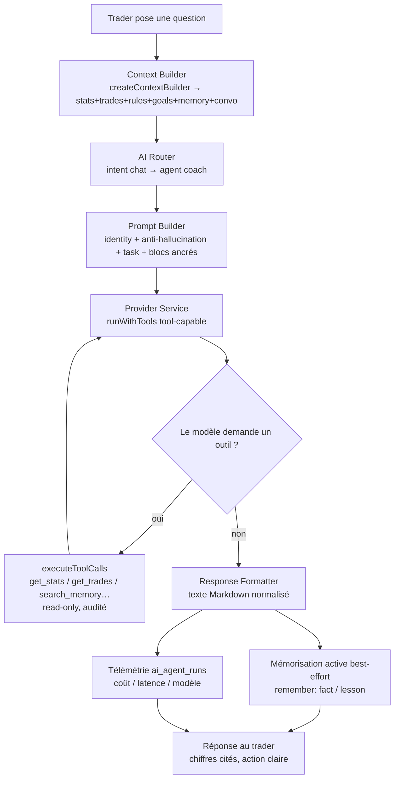

# Agent — AI Coach

> **Conception (pas d'implémentation).** Spécification du **premier agent** de
> TradeVault, bâti sur l'AI Platform (`src/modules/ai/*` + `ai-provider`).
> Objectif : **répondre aux questions du trader à partir de ses données réelles**.
> **L'agent n'invente jamais** ; il analyse uniquement les données de l'utilisateur.
>
> Références : [`AI-ARCHITECTURE.md`](../AI-ARCHITECTURE.md) (plateforme),
> [`AI.md`](../AI.md) (stratégie), [`ARCHITECTURE.md`](../ARCHITECTURE.md).

## 0. Identité & objectif

> Un **mentor de trading qui connaît ce trader** et répond exclusivement à partir
> de ses données réelles. Il **interprète**, il ne calcule ni n'invente jamais.

- **AgentId** : `coach` (déjà déclaré dans `agents/catalog.ts`).
- **Intentions routées** (`INTENT_AGENT`) : `chat`, `analyze_trade`, `daily_brief`.
- **Principe fondateur** : *déterministe avant IA* — les chiffres viennent des
  moteurs (`trading/analysis`, `quantStats`) ; le coach les **traduit** en langage
  clair et en actions.

## 1. Contexte (Context Builder)

Assemblé côté client via `createContextBuilder()`, **capé**, sérialisé en **blocs
ancrés citables** (`contextBlocks`).

| Bloc | Source | Cap | Rôle |
|---|---|---|---|
| `stats` | `useTradeStats` (précalculé, déterministe) | — | **La vérité chiffrée** citée par le coach |
| `trades` | cache trades du compte actif | ≤ 500 | Contexte factuel récent |
| `rules` | `loadTradingRules` | ≤ 30 | Règles que le trader s'est fixées |
| `goals` | `goal_plans` | ≤ 10 | Objectifs & progression |
| `memory` | `ai_memory` (profile/fact/lesson) | ≤ 60, ≤ 2000 c/entrée | Ce que le coach sait déjà |
| `conversation` | fil courant | ≤ 20 tours, ≤ 8000 c | Continuité multi-tours |
| `language` | UI | — | Langue de réponse |

**Règle d'or** : on injecte des **stats précalculées** → le modèle **cite**, il ne
recalcule pas (anti-hallucination + économie de tokens). Tous les champs sont
optionnels → **dégradation gracieuse**.

## 2. Mémoire (AI Memory)

Table `ai_memory`, **RLS owner-only**, 4 types :

| kind | Contenu | Écriture |
|---|---|---|
| `profile` | Qui est le trader (niveau, marché, style, horaires) | seedé à l'onboarding (déterministe, 0 coût IA) |
| `fact` | Observations durables (« oversize après 2 pertes ») | **mémorisation active** (extraction post-réponse) |
| `lesson` | Leçons émises **et acceptées** par le trader | mémorisation active |
| `conversation` | Fil roulant fenêtré | à chaque tour |

- **Lecture** : `loadMemory(userId, ["profile","fact","lesson"])` → injecté au contexte.
- **Écriture** : `remember(userId, kind, content)` — **best-effort** (`try/catch`) :
  un échec DB ne casse jamais la réponse.
- **Cible 24 mois** : extraction IA des engagements/leçons, fil cross-device,
  compaction pour borner le coût.

## 3. Outils (Tool System)

Tous **read-only** (`sideEffect: false`), **permissionnés**, **audités**, exécutés
par le runtime (`executeToolCalls`) — jamais par le modèle. Manifeste du coach
(depuis `agents/catalog.ts`) :

| Outil | Entrée | Sortie | But |
|---|---|---|---|
| `get_stats` | `{ period? }` | snapshot quant (winRate, PF, drawdown, expectancy, streaks…) | Source chiffrée de référence |
| `get_trades` | `{ filter?, limit? }` | trades réels (symbole, R, PnL, erreurs, confluences) | Détail factuel à la demande |
| `search_memory` | `{ query, kinds? }` | entrées `ai_memory` pertinentes | Rappeler ce que le coach sait |
| `get_rules` | `{}` | règles du trader (actives/inactives) | Confronter comportement ↔ règles |
| `get_goals` | `{}` | objectifs + progression | Contextualiser au projet du trader |

**Doctrine** : un outil **réutilise les moteurs/stores existants** — aucune logique
métier dedans. Le contexte de base couvre la majorité des questions ; les outils
servent à **approfondir** (ex. filtrer les trades d'un symbole). Chaque appel est
journalisable (`ai_agent_runs`).

## 4. Limites (garde-fous)

1. **Ne jamais inventer** : toute affirmation chiffrée **doit** provenir de
   `stats`/outils. Interdit d'estimer un nombre absent.
2. **Données manquantes = le dire** explicitement (« pas assez de données »)
   plutôt que combler.
3. **Read-only strict** : aucun outil à effet de bord ; l'état n'est jamais modifié.
4. **Périmètre utilisateur** : RLS owner-only + `ToolContext { userId }` → le coach
   ne voit **que** les données de ce trader.
5. **Pas de conseil financier / promesse de gain** : il coache la discipline & la
   performance passée, ne prédit pas les marchés.
6. **Budget** : `maxTokens` par appel, `maxIterations` bornée, rate-limit
   `consume_ai_quota`.
7. **Langue** : réponse **toujours** dans la langue de l'UI.
8. **Robustesse** : mémoire/outils best-effort → jamais de blocage sur panne partielle.

## 5. Prompts système

**Identité (system, fixe)** — `COACH_IDENTITY(lang)` :

> « Tu es le coach de performance de trading de TradeVault — un mentor quant
> d'élite qui CONNAÎT ce trader (sa mémoire, ses règles et ses objectifs te sont
> fournis). Chaque affirmation DOIT citer des chiffres précis issus des données
> fournies. N'invente JAMAIS de nombre. Si une donnée manque, dis-le. Sois franc,
> concret, bienveillant-mais-ferme. Écris TOUTE la réponse en {lang}. »

**Bloc anti-hallucination (renforcé, system)** :

> « Sources autorisées : uniquement `PRECOMPUTED STATS`, `RECENT TRADES`,
> `THE TRADER'S OWN RULES`, `ACTIVE GOALS`, `LONG-TERM MEMORY` et les résultats
> d'outils. Toute donnée hors de ces sources est interdite. En cas de doute →
> demander ou déclarer l'absence de donnée. »

**Tâche + format de sortie** (ex. intention `chat`) :

> Markdown structuré : `## 🎯 Key Takeaways` (3–5 puces, chiffres réels) ·
> `## 📊 Stats Snapshot` (table compacte) · `## ✅ Strengths` · `## ⚠️ Weaknesses` ·
> `## 🧭 Action Plan` (numéroté, mesurable) · `## 💡 Bottom Line` (une phrase).
> Omettre une section si non applicable. **Gras** sur les chiffres clés.

Assemblé par `buildPrompt({ identity, task, contextBlocks, conversation, userTurn,
outputFormat })` — la persona est **injectée**, pas codée en dur dans l'infra.

## 6. Flux complet

**Étapes** :
1. **Contexte** assemblé et capé côté client.
2. **Router** : `chat` → agent `coach` (déterministe), décide `useRetrieval`.
3. **Prompt** : identité + garde-fous + tâche + blocs ancrés + fil.
4. **Génération** via `runWithTools` sur un provider tool-capable (OpenAI/Anthropic).
5. **Boucle d'outils** bornée : le modèle réclame `get_stats`/`get_trades`/… →
   `executeToolCalls` renvoie des **données réelles** → réinjectées.
6. **Formatage** de la sortie (Markdown structuré).
7. **Mémorisation active** (fact/lesson) + **télémétrie** — best-effort, non bloquantes.
8. **Réponse** : chaque chiffre est cité depuis les données ; sinon, absence déclarée.

## 7. Garantie « ne jamais inventer » — défense en profondeur

| Couche | Mécanisme |
|---|---|
| **Contexte** | Stats **précalculées** injectées → rien à estimer |
| **Prompt** | Identité + bloc anti-hallucination : citer ou déclarer l'absence |
| **Outils** | Retournent des **données réelles** (RLS), pas des suppositions |
| **Format** | `Stats Snapshot` force l'adossement aux chiffres |
| **Limites** | Read-only, périmètre utilisateur, langue, budgets |
| **Audit** | `ai_agent_runs` : chaque réponse traçable |

## 8. Étape d'implémentation (plus tard, hors de ce document)

`agents/coach.agent.ts` = un `run()` qui appelle `buildPrompt` + `runWithTools`
avec le manifeste ci-dessus ; + les 5 outils read-only ; + brancher les 2 surfaces
UI (Coach IA) dessus — **sans toucher** au reste de l'infra (extension par plug-in).
